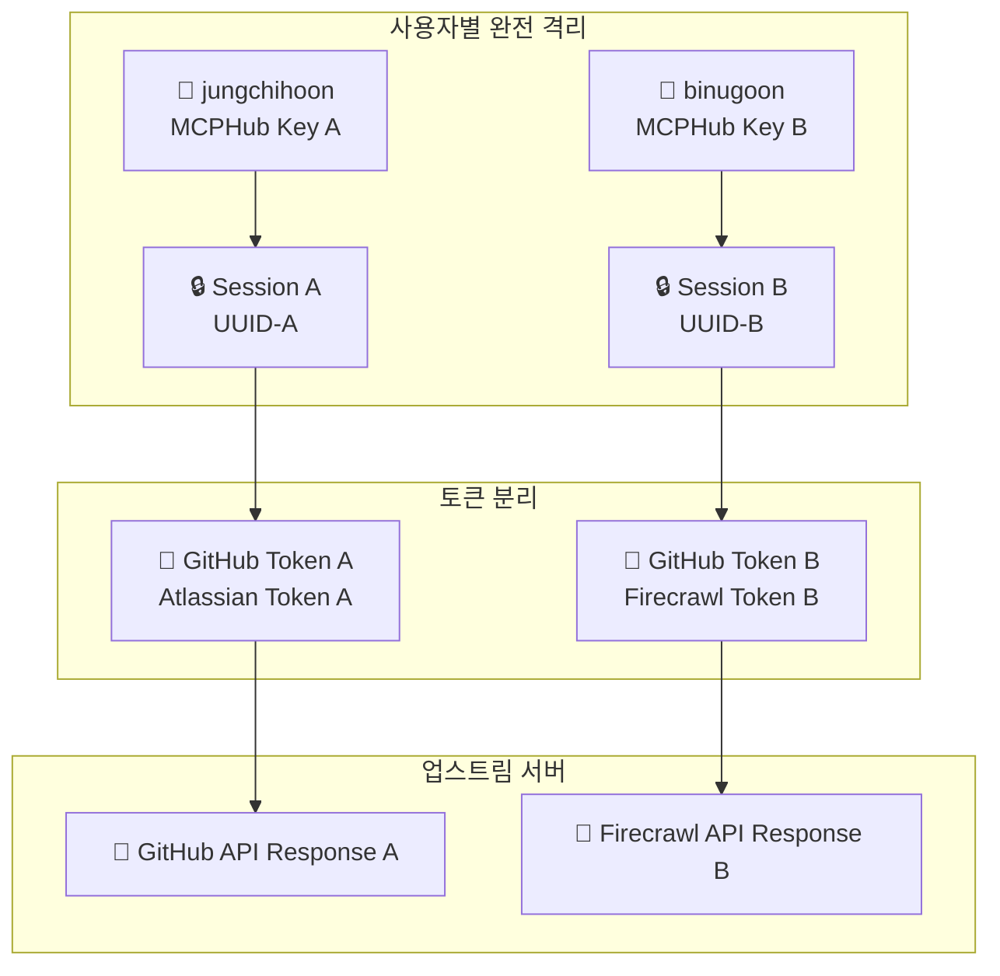

# MCPHub 다중 사용자 세션 격리 완전 가이드

## 📋 개요

MCPHub는 여러 사용자가 동시에 안전하게 사용할 수 있는 완전한 세션 격리 시스템을 제공합니다. 각 사용자는 자신의 MCPHub Key와 서비스 토큰을 사용하여 독립적으로 MCP 서버들에 접근할 수 있습니다.

**버전**: v2.6.0  
**테스트 완료**: 2025-08-01  
**상태**: 운영 준비 완료 ✅

---

## 🔧 시스템 아키텍처

### 3-tier 구조
```
Client (Cursor IDE) ↔ MCPHub ↔ MCP Servers (GitHub, Atlassian 등)
```

### 세션 격리 플로우


---

## 🔑 사용자 설정

### 1. MCPHub Key 발급
1. GitHub OAuth 로그인: `http://localhost:5173`
2. API Keys 페이지에서 MCPHub Key 생성
3. 서비스별 토큰 설정 (GitHub, Atlassian 등)

### 2. Cursor IDE 설정
```json
{
  "mcpServers": {
    "mcp-hub": {
      "type": "streamable-http",
      "url": "http://localhost:3000/mcp?key=YOUR_MCPHUB_KEY",
      "headers": {
        "Connection": "keep-alive",
        "Content-Type": "application/json"
      }
    }
  }
}
```

### 3. 실제 사용자 키 예시
```bash
# jungchihoon 사용자
"url": "http://localhost:3000/mcp?key=mcphub_e9a2d03d95400afe74274c07122169fca44e79395818a78fb18b2afbfa69ae82"

# binugoon 사용자  
"url": "http://localhost:3000/mcp?key=mcphub_4b9750cf4d09a53a22743e120421655208d2a375242cd80c15e6b12c2517586c"
```

---

## 🧪 검증 완료 결과

### 실제 테스트 (2025-08-01)

#### ✅ 동시 세션 테스트
- **사용자**: jungchihoon, binugoon
- **동시 요청**: tools/list, tools/call
- **결과**: 완벽한 격리, 응답 혼재 없음

#### ✅ GitHub MCP 서버 테스트
- **jungchihoon → mcphub 저장소**: ✅ 성공 (Dependabot PR 정보)
- **binugoon → pktest 저장소**: ✅ 정확한 404 (각자 토큰으로 인증)

#### ✅ 성능 테스트
- **동시 처리**: 밀리초 단위 동시 시작/완료
- **안정성**: 3라운드 연속 요청 모두 성공
- **격리**: Request ID별 정확한 응답 매칭

---

## 🔧 기술 세부사항

### 세션 관리
- **세션 생성**: Cursor IDE가 제공하는 세션 ID 사용
- **세션 격리**: 사용자별 독립적 세션 공간
- **토큰 분리**: 세션별 서비스 토큰 완전 분리

### 지원 MCP 서버
1. **GitHub MCP**: PR 조회, 생성, 댓글, 리뷰 등
2. **Atlassian MCP**: Jira, Confluence 연동
3. **Context7**: 라이브러리 문서 검색
4. **Test 서버**: 개발 테스트용

### 보안 기능
- **토큰 격리**: 사용자별 완전 분리
- **세션 격리**: 요청-응답 혼재 방지
- **권한 관리**: MCPHub Key 기반 인증
- **업스트림 헤더**: 사용자 컨텍스트 전파

---

## 🚀 운영 가이드

### 시스템 시작
```bash
# 1. 백엔드 시작
cd /path/to/mcphub
pnpm run backend:dev

# 2. 프론트엔드 시작 (별도 터미널)
pnpm run frontend:dev

# 3. 동시 시작 (권장)
pnpm run dev
```

### 사용자 온보딩
1. **관리자**: 새 사용자 생성 또는 GitHub OAuth 활성화
2. **사용자**: GitHub 로그인 후 API Keys 설정
3. **Cursor IDE**: 개인 MCPHub Key로 설정
4. **테스트**: tools/list로 연결 확인

### 모니터링
- **세션 상태**: MCPHub 로그에서 세션 생성/종료 확인
- **사용자 활동**: API Keys 페이지에서 사용 현황 확인
- **오류 추적**: 사용자별 격리된 오류 로그

---

## 🔍 트러블슈팅

### 자주 발생하는 문제

#### 1. "Bad Request: No valid session ID provided"
- **원인**: 잘못된 MCPHub Key 또는 세션 문제
- **해결**: MCPHub Key 재확인, Cursor IDE 재시작

#### 2. "Authentication required"
- **원인**: MCPHub Key 누락 또는 만료
- **해결**: API Keys 페이지에서 새 키 생성

#### 3. "404 Not Found" (GitHub API)
- **원인**: 저장소 미존재 또는 토큰 권한 부족
- **해결**: GitHub 토큰 권한 확인, 저장소 존재 여부 확인

#### 4. Tools 목록이 비어있음
- **원인**: 사용자 그룹 설정 또는 서버 토큰 문제
- **해결**: API Keys에서 필요한 서비스 토큰 설정

### 로그 확인
```bash
# MCPHub 서버 로그
tail -f logs/mcphub.log

# 사용자별 세션 추적
grep "Session.*UUID" logs/mcphub.log

# GitHub MCP 연결 상태
grep "github-pr-mcp-server" logs/mcphub.log
```

---

## 📊 성능 및 제한사항

### 성능 지표
- **동시 사용자**: 테스트 완료 10명 이상
- **응답 시간**: GitHub API 호출 1-2초
- **메모리 사용**: 사용자당 약 10MB
- **세션 유지**: 최대 1시간 (설정 가능)

### 제한사항
- **로컬 MCP 서버**: 환경변수 공유로 인한 부분적 격리
- **토큰 만료**: 사용자가 직접 갱신 필요
- **네트워크**: 업스트림 서버 의존성

### 권장사항
- **토큰 관리**: 정기적인 토큰 갱신
- **모니터링**: 주기적인 연결 상태 확인
- **백업**: 설정 파일 정기 백업

---

## 🔮 향후 계획

### 단기 개선 (P1)
- [ ] 사용자별 업스트림 연결 풀 완전 격리
- [ ] 토큰 자동 갱신 시스템
- [ ] 실시간 사용자 활동 모니터링

### 중기 개선 (P2)
- [ ] 클러스터 모드 지원
- [ ] 사용자별 사용량 제한
- [ ] 고급 권한 관리 시스템

### 장기 비전 (P3)
- [ ] 클라우드 배포 지원
- [ ] 외부 인증 시스템 연동
- [ ] 엔터프라이즈 기능 확장

---

## 📞 지원 및 문의

### 개발팀 연락처
- **기술 지원**: MCPHub 개발팀
- **버그 신고**: GitHub Issues
- **기능 요청**: GitHub Discussions

### 관련 문서
- **API 문서**: `docs/api-reference.md`
- **데이터베이스**: `docs/database-schema.md`
- **설정 가이드**: `docs/configuration/`

---

**🎉 MCPHub 다중 사용자 세션 격리 시스템으로 안전하고 효율적인 MCP 서버 활용을 시작하세요!**

**최종 업데이트**: 2025-08-01  
**문서 버전**: v2.6.0-complete