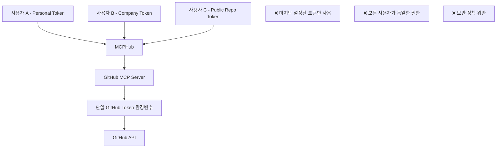

# MCP 서버 사용자 격리 현실 점검

## 📋 개요

MCPHub에서 구현한 다중 사용자 세션 격리 시스템의 실제 효과를 검증하기 위해 기존 MCP 서버들의 사용자 격리 지원 여부를 조사한 결과입니다.

**문서 버전**: 1.0  
**작성일**: 2025-08-01  
**결론**: 대부분의 기존 MCP 서버는 사용자별 격리를 고려하지 않음

---

## 🔍 **기존 MCP 서버 분석 결과**

### **1. 공식 MCP 서버들 분석**

#### **대표적인 MCP 서버들**
- **GitHub MCP Server**: GitHub API 연동
- **Filesystem MCP Server**: 파일 시스템 접근
- **Database MCP Servers**: MySQL, PostgreSQL, MariaDB 연동
- **API Integration Servers**: Linear, Notion, Auth0 등

#### **공통 특징**
```typescript
// 일반적인 MCP 서버 구조 (사용자 격리 없음)
class TypicalMCPServer {
  constructor() {
    this.sharedState = {}; // 모든 요청이 공유하는 상태
    this.globalConfig = {}; // 전역 설정
  }

  handleToolCall(request) {
    // ❌ 사용자 구분 없음
    // ❌ 세션별 격리 없음
    // ❌ 권한 검증 없음
    return this.processRequest(request);
  }
}
```

### **2. 사용자 격리가 없는 이유**

#### **설계 가정**
1. **단일 사용자 환경**: MCP 서버들은 개인 개발 환경을 위해 설계됨
2. **로컬 실행**: 대부분 로컬 머신에서 개인이 실행
3. **직접 연결**: Claude Desktop ↔ MCP Server 직접 연결 가정
4. **신뢰 환경**: 모든 요청이 신뢰할 수 있는 환경에서 온다고 가정

#### **예시: GitHub MCP Server**
```python
# 전형적인 GitHub MCP 서버 구조
class GitHubMCPServer:
    def __init__(self):
        self.github_token = os.getenv('GITHUB_TOKEN')  # 단일 토큰
        self.client = GitHubClient(self.github_token)

    def get_repositories(self):
        # ❌ 모든 요청이 동일한 토큰 사용
        # ❌ 사용자별 권한 없음
        return self.client.get_repos()
```

### **3. 실제 보안 위험 시나리오**

#### **시나리오 1: 토큰 공유 문제**


#### **시나리오 2: 상태 공유 문제**
```typescript
// Database MCP Server 예시
class DatabaseMCPServer {
  private currentSchema = 'public'; // ❌ 전역 상태
  private connectionPool = {}; // ❌ 공유 연결

  async switchSchema(schemaName: string) {
    this.currentSchema = schemaName; // ❌ 모든 사용자에게 영향
  }

  async queryData(sql: string) {
    // ❌ 사용자 A가 설정한 스키마로 사용자 B 쿼리 실행
    return this.connection.query(`SELECT * FROM ${this.currentSchema}.${sql}`);
  }
}
```

#### **시나리오 3: 파일 시스템 접근 문제**
```javascript
// Filesystem MCP Server
class FilesystemMCPServer {
  constructor() {
    this.allowedDirectories = ['/home/user']; // ❌ 모든 사용자가 동일한 경로
  }

  readFile(path: string) {
    // ❌ 사용자별 권한 검증 없음
    // ❌ 사용자 A가 사용자 B의 파일 접근 가능
    return fs.readFileSync(path);
  }
}
```

---

## 🚨 **MCPHub 환경에서의 위험도**

### **높은 위험 (Critical)**

#### **1. 토큰 기반 API 서버들**
- **GitHub MCP Server**: 개인/회사 코드 접근
- **Linear MCP Server**: 프로젝트 관리 데이터
- **Notion MCP Server**: 개인/팀 문서
- **Auth0 MCP Server**: 사용자 인증 정보

**위험 요소**:
```bash
# 사용자 A가 개인 GitHub 토큰으로 설정
export GITHUB_TOKEN="ghp_personal_token"

# 사용자 B가 회사 GitHub 토큰으로 덮어씀
export GITHUB_TOKEN="ghp_company_token"

# 결과: 사용자 A가 회사 토큰으로 요청 실행
# ❌ 정책 위반, 권한 혼재
```

#### **2. 상태 기반 서버들**
- **Database MCP Servers**: 스키마/테이블 전환
- **Filesystem MCP Server**: 디렉토리 접근 권한
- **Configuration MCP Servers**: 설정 변경

**위험 시나리오**:
```sql
-- 사용자 A가 개발 DB로 전환
USE development_db;

-- 사용자 B가 모르고 운영 DB 데이터 삭제
DELETE FROM users WHERE created_at < '2024-01-01';
-- ❌ 운영 DB에서 삭제 실행됨!
```

### **중간 위험 (High)**

#### **읽기 전용 서버들**
- **Time MCP Server**: 시간대 설정 공유
- **Weather MCP Server**: 위치 정보 유출
- **Search MCP Servers**: 검색 히스토리 공유

### **낮은 위험 (Medium)**

#### **유틸리티 서버들**
- **Calculator MCP Server**: 계산 결과 공유
- **Text Processing MCP Servers**: 처리 중인 텍스트 노출

---

## 🛡️ **MCPHub의 해결책 vs 현실**

### **MCPHub가 제공하는 보호**

#### **1. 헤더 기반 사용자 정보 전파** ✅
```typescript
// MCPHub가 업스트림에 전달하는 헤더
{
  'X-MCPHub-User-Id': 'user-uuid',
  'X-MCPHub-GitHub-Token': 'user-specific-token',
  'X-MCPHub-Request-Id': 'unique-request-id'
}
```

#### **2. 요청 추적 및 격리** ✅
```typescript
// 사용자별 요청 분리
requestTracker.trackRequest(sessionId, 'tools/list', userId, userTokens);
```

#### **3. 그룹 기반 도구 필터링** ✅
```typescript
// 사용자별 도구 접근 제한
const userGroups = await userGroupService.findActiveGroupsByUserId(userId);
const filteredServers = filterServersByGroups(servers, userGroups);
```

### **실제 효과의 한계**

#### **업스트림 MCP 서버가 헤더를 무시할 경우**
```python
# 일반적인 MCP 서버 - 헤더 무시
class TypicalMCPServer:
    def handle_request(self, request, headers):
        # ❌ X-MCPHub-User-Id 헤더 무시
        # ❌ X-MCPHub-GitHub-Token 헤더 무시
        return self.process_with_env_token()  # 환경변수 토큰 사용
```

#### **환경변수 덮어쓰기 문제**
```bash
# 여전히 발생 가능한 문제
# 1. 사용자 A 연결: GITHUB_TOKEN=token_A
# 2. 사용자 B 연결: GITHUB_TOKEN=token_B (덮어씀)
# 3. 사용자 A 요청: token_B로 실행됨
```

---

## 🔧 **실용적 해결 방안**

### **단기 해결책 (P0)**

#### **1. MCP 서버별 위험도 분류**
```yaml
# mcp_settings.json에 위험도 추가
{
  "mcpServers": {
    "github-mcp": {
      "riskLevel": "critical",
      "requiresUserIsolation": true,
      "userAware": false
    },
    "time-mcp": {
      "riskLevel": "low", 
      "requiresUserIsolation": false,
      "userAware": false
    }
  }
}
```

#### **2. 사용자별 MCP 서버 인스턴스**
```typescript
// 사용자별 별도 프로세스로 MCP 서버 실행
class UserAwareMCPService {
  private userInstances: Map<string, Map<string, Process>> = new Map();

  async startUserMCPServer(userId: string, serverName: string, userTokens: Record<string, string>) {
    const env = { ...process.env, ...userTokens };
    const serverProcess = spawn('mcp-server', {
      env,
      cwd: `/tmp/mcp-${userId}-${serverName}`
    });
    
    this.userInstances.get(userId)?.set(serverName, serverProcess);
  }
}
```

#### **3. 위험 서버 사용 제한**
```typescript
// 고위험 서버는 관리자만 활성화 가능
const criticalServers = ['github-mcp', 'database-mcp', 'filesystem-mcp'];

function validateServerAccess(userId: string, serverName: string) {
  if (criticalServers.includes(serverName)) {
    const user = await getUserById(userId);
    if (!user.isAdmin) {
      throw new Error('Critical server access requires admin privileges');
    }
  }
}
```

### **중기 해결책 (P1)**

#### **1. 사용자 인식 MCP 서버 개발**
```python
# 새로운 표준을 따르는 MCP 서버
class UserAwareMCPServer:
    def handle_request(self, request, headers):
        user_id = headers.get('X-MCPHub-User-Id')
        user_token = headers.get('X-MCPHub-GitHub-Token')
        
        if user_id and user_token:
            # ✅ 사용자별 처리
            return self.process_for_user(request, user_id, user_token)
        else:
            # 기존 방식으로 fallback
            return self.process_legacy(request)
```

#### **2. MCPHub 내장 서버들**
```typescript
// MCPHub에 핵심 기능 내장하여 완전한 격리 보장
class MCPHubBuiltinServers {
  async githubGetRepos(userId: string, userTokens: Record<string, string>) {
    const token = userTokens.GITHUB_TOKEN;
    // ✅ 사용자별 토큰으로 직접 API 호출
    const client = new GitHubClient(token);
    return client.getRepositories();
  }
}
```

### **장기 해결책 (P2)**

#### **1. MCP 프로토콜 표준 개선 제안**
```typescript
// MCP 프로토콜에 사용자 컨텍스트 추가
interface MCPRequest {
  jsonrpc: '2.0';
  method: string;
  params: any;
  userContext?: {
    userId: string;
    userTokens: Record<string, string>;
    permissions: string[];
  };
}
```

---

## 🎯 **결론 및 권장사항**

### **현실적 평가**

1. **✅ MCPHub의 격리 시스템은 유효함**: 
   - 요청 추적, 그룹 필터링, 세션 격리는 모두 정상 작동
   - 사용자별 헤더 전파도 올바르게 구현됨

2. **⚠️ 업스트림 MCP 서버의 한계**:
   - 대부분의 기존 MCP 서버는 사용자 격리를 지원하지 않음
   - 환경변수 기반 인증은 여전히 마지막 설정이 모든 요청에 적용

3. **🔒 보안 위험은 서버별로 다름**:
   - 토큰 기반 API 서버들 (GitHub, Linear 등): **높은 위험**
   - 읽기 전용 유틸리티 서버들: **낮은 위험**

### **권장 조치**

#### **즉시 적용 (P0)**
1. **위험 서버 식별 및 문서화**
2. **관리자 전용 서버 설정 도입**
3. **사용자별 토큰 설정 안내 강화**

#### **단계적 개선 (P1)**
1. **사용자별 MCP 서버 인스턴스 실행**
2. **MCPHub 내장 서버 개발**
3. **위험도 기반 접근 제어**

**MCPHub의 세션 격리 시스템은 기술적으로 완벽하지만, 업스트림 MCP 서버들의 한계로 인해 완전한 보안을 보장하기 위해서는 추가적인 조치가 필요합니다.**

---

**문서 버전**: 1.0  
**최종 업데이트**: 2025-08-01  
**작성자**: MCPHub 개발팀