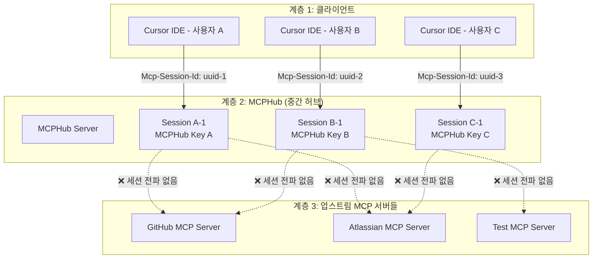
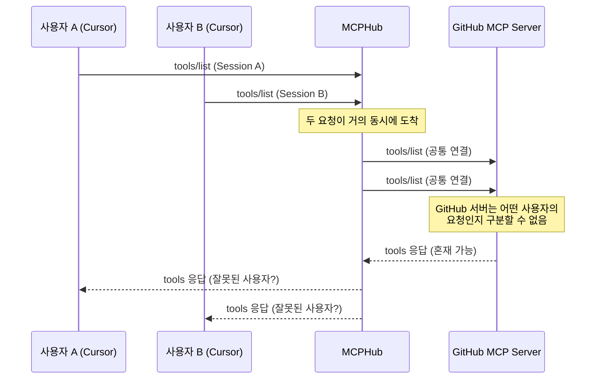
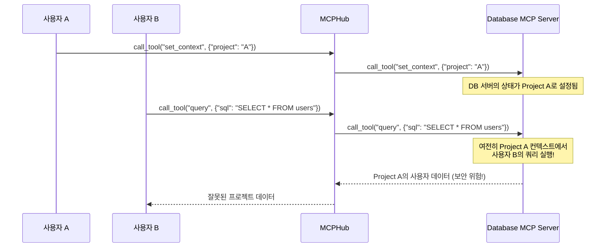
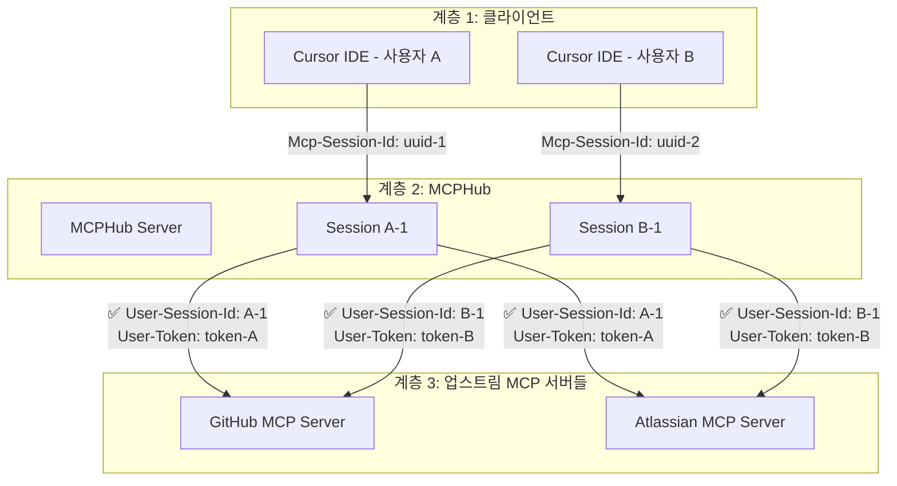

# MCPHub 다중 사용자 세션 처리 문제 분석

## 📋 개요

MCPHub는 3계층 아키텍처 (Cursor ↔ MCPHub ↔ MCP Servers)에서 동작하며, 다중 사용자 환경에서 세션 처리 관련 문제들이 발생할 수 있습니다.

**문서 버전**: 1.0.0  
**작성일**: 2025-08-02  
**대상**: 개발자, 시스템 관리자

---

## 🏗️ **현재 아키텍처와 문제점**

### 📊 **3계층 구조**



---

## 🚨 **주요 문제점들**

### 1. **세션 전파 부재 문제**

#### **현재 상황**
```typescript
// MCPHub는 Cursor로부터 세션을 받음
const sessionId = req.headers['mcp-session-id'] as string;

// 하지만 업스트림 MCP 서버로 세션을 전달하지 않음
const server = getMcpServer(sessionId, group, userServiceTokens);
// ❌ server는 업스트림과 연결할 때 세션 정보를 전달하지 않음
```

#### **문제의 영향**
- **사용자 격리 실패**: 업스트림 MCP 서버에서 사용자별 구분 불가
- **상태 혼재**: 여러 사용자의 요청이 동일한 업스트림 세션에서 처리
- **보안 위험**: 사용자 A의 요청이 사용자 B의 컨텍스트에서 실행 가능

### 2. **업스트림 연결 공유 문제**

#### **현재 구현**
```typescript
// src/services/mcpService.ts
export const getMcpServer = (sessionId?: string, group?: string, userServiceTokens?: Record<string, string>): Server => {
  if (!servers[sessionId]) {
    // 새 서버 인스턴스 생성하지만...
    const server = createMcpServer(config.mcpHubName, config.mcpHubVersion, serverGroup, userServiceTokens);
    servers[sessionId] = server;
  }
  return servers[sessionId];
};
```

#### **문제점**
- **세션별 서버 인스턴스는 있지만 업스트림 연결은 공유됨**
- **업스트림 MCP 서버들은 MCPHub로부터 하나의 연결만 받음**
- **다중 사용자의 요청이 동일한 업스트림 연결에서 섞임**

### 3. **사용자 인증 전파 문제**

#### **현재 상황**
```typescript
// MCPHub에서 사용자 토큰은 저장되지만...
if (userServiceTokens) {
  (server as any).userServiceTokens = userServiceTokens;
}

// 업스트림 MCP 서버로 전달되지 않음
// 업스트림 서버는 어떤 사용자의 요청인지 알 수 없음
```

#### **문제의 영향**
- **업스트림 권한 제어 불가**: 업스트림 서버에서 사용자별 권한 적용 불가
- **사용자별 설정 미적용**: 업스트림에서 사용자별 맞춤 설정 불가
- **감사 로그 부재**: 업스트림에서 사용자별 활동 추적 불가

---

## 🔍 **구체적인 시나리오별 문제**

### 시나리오 1: 동시 사용자 접근



**문제점**:
- GitHub MCP 서버는 요청의 출처를 구분할 수 없음
- 사용자 A의 GitHub 권한과 사용자 B의 권한이 혼재될 수 있음
- 캐시된 응답이 잘못된 사용자에게 전달될 수 있음

### 시나리오 2: 상태 기반 MCP 서버



**문제점**:
- 상태를 유지하는 MCP 서버에서 사용자 간 상태 혼재
- 보안 위험: 다른 사용자의 데이터에 접근 가능
- 데이터 정합성 문제: 잘못된 컨텍스트에서 작업 수행

### 시나리오 3: 인증이 필요한 MCP 서버

```python
# 업스트림 MCP 서버 (예: Jira MCP)
@server.call_tool()
async def create_issue(name: str, arguments: dict):
    # ❌ 문제: 어떤 사용자의 요청인지 알 수 없음
    # MCPHub로부터 사용자 정보가 전달되지 않음
    
    # 현재는 하드코딩된 토큰 사용
    jira_token = os.getenv('JIRA_TOKEN')  # 모든 사용자가 동일한 토큰
    
    # ✅ 이상적: 사용자별 토큰 사용해야 함
    # user_jira_token = get_user_token(user_id)
```

**문제점**:
- 모든 사용자가 동일한 서비스 토큰 사용
- 사용자별 권한 제어 불가
- 업스트림 서비스에서 사용자 구분 불가

---

## 🛠️ **해결 방안**

### 1. **세션 전파 메커니즘 구현**

#### **목표 아키텍처**


#### **구현 방안**

```typescript
// 1. 사용자별 세션 ID 생성
const generateUserSessionId = (mcpHubSessionId: string, userId: string): string => {
  return `${userId}-${mcpHubSessionId.substring(0, 8)}`;
};

// 2. 업스트림 연결 시 사용자 정보 전달
const connectToUpstream = async (
  upstreamServer: ServerConfig, 
  userSessionId: string,
  userServiceTokens: Record<string, string>
) => {
  const transport = new StreamableHTTPClientTransport({
    url: upstreamServer.url,
    headers: {
      'User-Session-Id': userSessionId,           // 사용자별 세션 ID
      'User-Id': userId,                          // 사용자 ID
      'Authorization': `Bearer ${userToken}`,     // 사용자별 토큰
      ...upstreamServer.headers
    }
  });
  
  return transport;
};

// 3. 업스트림별 사용자 세션 관리
const upstreamConnections: {
  [upstreamServer: string]: {
    [userSessionId: string]: Client
  }
} = {};
```

### 2. **업스트림 MCP 서버 수정**

#### **사용자 컨텍스트 인식**
```python
# 업스트림 MCP 서버 수정 예시
@server.call_tool()
async def call_tool(name: str, arguments: dict, context: dict = None):
    # 사용자 정보 추출
    user_session_id = context.get('User-Session-Id')
    user_id = context.get('User-Id') 
    user_token = context.get('User-Token')
    
    # 사용자별 컨텍스트 설정
    user_context = get_user_context(user_id)
    
    # 사용자별 권한 확인
    if not has_permission(user_id, name):
        raise PermissionError(f"User {user_id} has no permission for {name}")
    
    # 사용자별 토큰으로 외부 서비스 호출
    external_service = connect_with_user_token(user_token)
    
    return await execute_tool(name, arguments, user_context)
```

### 3. **MCPHub 세션 관리 개선**

#### **사용자별 업스트림 연결 풀**
```typescript
class UserAwareConnectionPool {
  private connections: Map<string, Map<string, Client>> = new Map();
  
  getConnection(userId: string, upstreamServer: string): Client | undefined {
    return this.connections.get(userId)?.get(upstreamServer);
  }
  
  setConnection(userId: string, upstreamServer: string, client: Client): void {
    if (!this.connections.has(userId)) {
      this.connections.set(userId, new Map());
    }
    this.connections.get(userId)!.set(upstreamServer, client);
  }
  
  removeUserConnections(userId: string): void {
    const userConnections = this.connections.get(userId);
    if (userConnections) {
      for (const client of userConnections.values()) {
        client.close();
      }
      this.connections.delete(userId);
    }
  }
}
```

---

## ⚠️ **단기 해결책 (현재 시스템 개선)**

### 1. **요청 격리 강화**
```typescript
// 요청별 고유 ID 생성으로 혼재 방지
const generateRequestId = (sessionId: string, method: string): string => {
  return `${sessionId}-${method}-${Date.now()}-${Math.random()}`;
};

// 응답 매칭을 위한 요청 추적
const pendingRequests: Map<string, PendingRequest> = new Map();
```

### 2. **사용자 토큰 전파**
```typescript
// 업스트림 요청 시 사용자 정보 헤더 추가
const forwardRequest = async (request: any, userServiceTokens: Record<string, string>) => {
  const headers = {
    'X-MCPHub-User-Id': userId,
    'X-MCPHub-Session': sessionId,
    'X-MCPHub-Timestamp': Date.now().toString(),
    ...getAuthHeaders(userServiceTokens)
  };
  
  return await upstreamClient.request(request, { headers });
};
```

### 3. **상태 격리**
```typescript
// 업스트림 서버별 사용자 상태 관리
const userStates: Map<string, Map<string, any>> = new Map();

const setUserState = (userId: string, serverId: string, state: any) => {
  if (!userStates.has(userId)) {
    userStates.set(userId, new Map());
  }
  userStates.get(userId)!.set(serverId, state);
};
```

---

## 🔬 **테스트 시나리오**

### 테스트 1: 동시 사용자 격리
```bash
# Terminal 1: 사용자 A
curl -X POST http://localhost:3000/mcp \
  -H "Mcp-Session-Id: session-a" \
  -H "Authorization: Bearer mcphub-key-a" \
  -d '{"method": "tools/list"}'

# Terminal 2: 사용자 B  
curl -X POST http://localhost:3000/mcp \
  -H "Mcp-Session-Id: session-b" \
  -H "Authorization: Bearer mcphub-key-b" \
  -d '{"method": "tools/list"}'

# 검증: 각 사용자가 자신의 그룹 도구만 받는지 확인
```

### 테스트 2: 상태 기반 서버 격리
```bash
# 사용자 A: 컨텍스트 설정
curl -X POST http://localhost:3000/mcp \
  -H "Mcp-Session-Id: session-a" \
  -d '{"method": "call_tool", "params": {"name": "set_context", "arguments": {"project": "project-a"}}}'

# 사용자 B: 다른 컨텍스트 설정  
curl -X POST http://localhost:3000/mcp \
  -H "Mcp-Session-Id: session-b" \
  -d '{"method": "call_tool", "params": {"name": "set_context", "arguments": {"project": "project-b"}}}'

# 사용자 A: 데이터 조회
curl -X POST http://localhost:3000/mcp \
  -H "Mcp-Session-Id: session-a" \
  -d '{"method": "call_tool", "params": {"name": "get_data"}}'

# 검증: 사용자 A가 project-a 데이터만 받는지 확인
```

---

## 📊 **우선순위별 개선 계획**

### **P0 (긴급) - 보안 위험 해결**
1. **요청 격리**: 사용자별 요청 ID 생성 및 추적
2. **토큰 전파**: 업스트림에 사용자 정보 헤더 전달
3. **세션 타임아웃**: 비활성 세션 자동 정리

### **P1 (높음) - 상태 격리**
1. **연결 풀 개선**: 사용자별 업스트림 연결 관리
2. **상태 격리**: 업스트림 서버별 사용자 상태 분리
3. **에러 격리**: 사용자별 에러 처리 및 복구

### **P2 (중간) - 성능 및 모니터링**
1. **연결 재사용**: 효율적인 연결 풀링
2. **메트릭 수집**: 사용자별 사용량 추적
3. **로그 개선**: 사용자별 요청 추적 로그

### **P3 (낮음) - 고도화**
1. **동적 라우팅**: 사용자별 업스트림 서버 선택
2. **로드 밸런싱**: 업스트림 서버 부하 분산
3. **캐시 전략**: 사용자별 응답 캐싱

---

## 📚 **관련 문서**

- [MCP 세션 관리 시스템](./mcp-session-management.md)
- [사용자 그룹 관리 시스템](./user-personal-groups-feature.md)
- [MCPHub 프로젝트 현황](./mcphub-project-status.md)

---

**이 문서는 MCPHub v2.1.0의 다중 사용자 세션 처리 문제점을 분석하고 해결 방안을 제시합니다.**