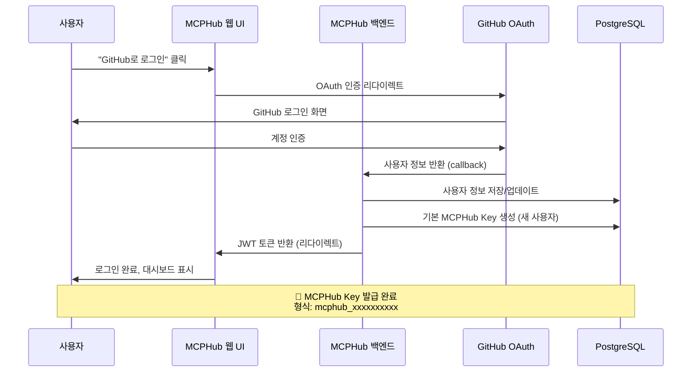
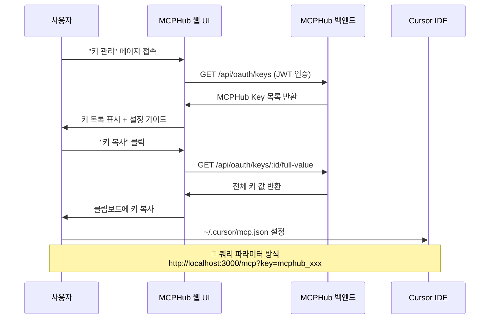
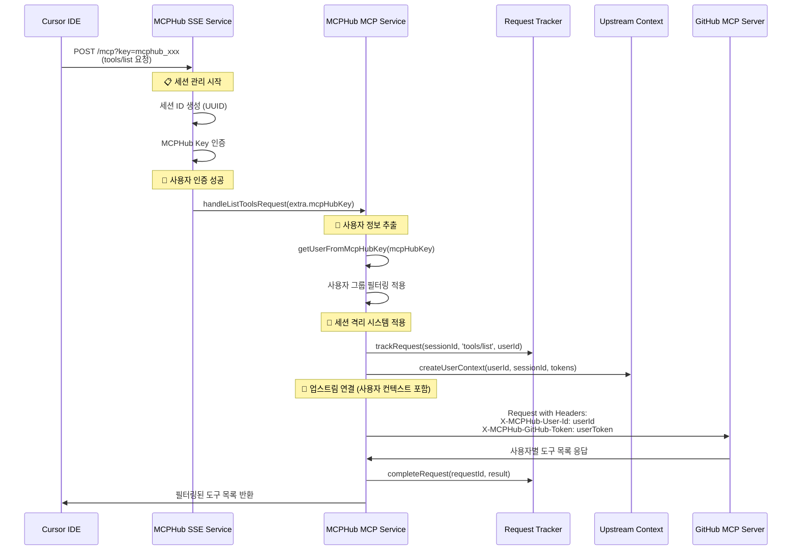

# MCPHub Key + 세션 격리 시스템 통합 플로우

## 📋 개요

MCPHub의 GitHub OAuth 기반 MCPHub Key 시스템과 새로 구현된 다중 사용자 세션 격리 시스템이 어떻게 통합되어 작동하는지 상세히 설명합니다.

---

## 🔄 **전체 플로우 (GitHub OAuth → Cursor IDE 연결)**

### **1단계: GitHub OAuth 로그인 & MCPHub Key 발급**



#### **핵심 코드 파일들**
- **Frontend**: `frontend/src/pages/LoginPage.tsx`
- **Backend**: `src/controllers/oauthController.ts`
- **Service**: `src/services/userService.ts` → `createDefaultMCPHubKey()`
- **Repository**: `src/db/repositories/MCPHubKeyRepository.ts`

### **2단계: MCPHub Key 관리 & Cursor 설정**



#### **핵심 코드 파일들**
- **Frontend**: `frontend/src/pages/KeyManagementPage.tsx`
- **Backend**: `src/controllers/oauthController.ts` → `getUserKeys()`, `getKeyValue()`
- **Service**: `src/services/mcpHubKeyService.ts`

### **3단계: Cursor IDE → MCPHub 연결 (세션 격리 적용)**



#### **핵심 코드 파일들**
- **SSE Service**: `src/services/sseService.ts` → `handleMcpPostRequest()`
- **MCP Service**: `src/services/mcpService.ts` → `handleListToolsRequest()`
- **Request Tracker**: `src/utils/requestTracker.ts`
- **Upstream Context**: `src/utils/upstreamContext.ts`

---

## 🔒 **세션 격리 시스템 통합 지점**

### **1. MCPHub Key 인증 통합**

**위치**: `src/services/sseService.ts` → `handleMcpPostRequest()`

```typescript
// 🔐 MCPHub Key 인증 (쿼리 파라미터 우선)
if (userKey && userKey.startsWith('mcphub_')) {
  const authenticatedTokens = await authenticateWithMcpHubKey(userKey);
  if (authenticatedTokens) {
    userServiceTokens = authenticatedTokens;
  }
}

// 📋 MCPHub Key를 서버 인스턴스에 저장
if (mcpHubKeyToStore) {
  (mcpServer as any).mcpHubKey = mcpHubKeyToStore;
}
```

### **2. 사용자 정보 추출 통합**

**위치**: `src/services/mcpService.ts` → `handleListToolsRequest()`

```typescript
// 👤 MCPHub Key로부터 사용자 정보 추출
const getUserFromMcpHubKey = async (mcpHubKey?: string) => {
  const mcpHubKeyService = new MCPHubKeyService();
  const authResult = await mcpHubKeyService.authenticateKey(mcpHubKey);
  
  if (authResult && authResult.user) {
    return {
      userId: authResult.user.id,
      user: authResult.user
    };
  }
  return null;
};

// 🔄 사용자별 컨텍스트 생성 및 요청 추적
if (userId && userServiceTokens) {
  const { context, trackingInfo } = upstreamContextPropagator.createUserContext(
    userId, sessionId, userServiceTokens, 'tools/list'
  );
}
```

### **3. 업스트림 헤더 전파 통합**

**위치**: `src/services/mcpService.ts` → `createTransportFromConfig()`

```typescript
// 🚀 사용자 컨텍스트가 있으면 업스트림 헤더 추가
if (userContext && userApiKeys) {
  const upstreamHeaders = upstreamContextPropagator.generateUpstreamHeaders({
    userId: userContext.userId,
    userSessionId: userContext.userSessionId,
    mcpHubSessionId: userContext.mcpHubSessionId,
    userServiceTokens: userApiKeys,
    requestId: userContext.requestId,
    timestamp: Date.now()
  }, serverName);
  
  Object.assign(headers, upstreamHeaders);
}
```

---

## 🧪 **통합 테스트 시나리오**

### **시나리오 1: 기본 인증 및 도구 목록 조회**

```bash
# 1. 사용자 A가 MCPHub Key로 연결
curl -X POST "http://localhost:3000/mcp?key=mcphub_user_a_key" \
  -H "Content-Type: application/json" \
  -H "Mcp-Session-Id: session-a-$(date +%s)" \
  -d '{"jsonrpc": "2.0", "id": 1, "method": "tools/list"}'

# 예상 결과: 사용자 A의 활성 그룹에 해당하는 도구만 반환
# 로그에서 확인:
# 👤 사용자 인증 성공: user-a-github-username (user-a-uuid)
# 🔄 업스트림 컨텍스트 생성: user-a | session-uuid... | request-uuid...
```

### **시나리오 2: 다중 사용자 동시 접속**

```bash
# Terminal 1: 사용자 A
curl -X POST "http://localhost:3000/mcp?key=mcphub_user_a_key" \
  -H "Content-Type: application/json" \
  -H "Mcp-Session-Id: session-a-$(date +%s)" \
  -d '{"jsonrpc": "2.0", "id": 1, "method": "tools/list"}'

# Terminal 2: 사용자 B (동시 실행)
curl -X POST "http://localhost:3000/mcp?key=mcphub_user_b_key" \
  -H "Content-Type: application/json" \
  -H "Mcp-Session-Id: session-b-$(date +%s)" \
  -d '{"jsonrpc": "2.0", "id": 2, "method": "tools/list"}'

# 예상 결과: 각 사용자가 자신의 그룹 설정에 따른 도구 목록 받음
# 업스트림 GitHub MCP 서버에서는 올바른 사용자별 토큰으로 구분 처리
```

### **시나리오 3: 사용자 그룹 필터링 검증**

```bash
# 1. 사용자 그룹을 모두 비활성화
# (프론트엔드에서 그룹 비활성화)

# 2. 도구 목록 요청
curl -X POST "http://localhost:3000/mcp?key=mcphub_user_key" \
  -H "Content-Type: application/json" \
  -H "Mcp-Session-Id: session-$(date +%s)" \
  -d '{"jsonrpc": "2.0", "id": 1, "method": "tools/list"}'

# 예상 결과: 빈 도구 목록 반환 (listOfferings: Found 0 tools)
```

---

## 🔧 **핵심 통합 요소들**

### **1. MCPHub Key 검증 체인**

```typescript
// 1. sseService.ts에서 MCPHub Key 인증
const authenticatedTokens = await authenticateWithMcpHubKey(userKey);

// 2. mcpHubKeyService.ts에서 키 유효성 검사
const authResult = await mcpHubKeyService.authenticateKey(keyValue);

// 3. 사용자 활성 상태 및 키 만료 확인
if (!key.isValid || !key.user.isActive) return null;

// 4. 사용자 서비스 토큰 반환
return { key, user: key.user, serviceTokens: key.serviceTokens };
```

### **2. 세션별 사용자 컨텍스트 저장**

```typescript
// StreamableHTTPServerTransport의 세션 생성 시
const sessionId = randomUUID(); // 고유 세션 ID 생성

// 세션별 사용자 정보 저장
transports.streamable[sessionId] = {
  transport,
  sessionId,
  userServiceTokens,     // 사용자별 API 토큰
  group,
  lastActivityTime: Date.now(),
  connectionStatus: 'connected'
};
```

### **3. 업스트림 헤더 자동 생성**

```typescript
// 업스트림 MCP 서버로 전달되는 헤더
{
  'X-MCPHub-User-Id': authResult.user.id,
  'X-MCPHub-User-Session-Id': `${userId}-${sessionId.substring(0, 8)}`,
  'X-MCPHub-Session-Id': sessionId,
  'X-MCPHub-Request-Id': requestId,
  'X-MCPHub-GitHub-Token': userServiceTokens.GITHUB_TOKEN,
  'X-MCPHub-Protocol-Version': '2025-06-18'
}
```

---

## ✅ **통합 검증 체크리스트**

### **P0 (필수 검증)**
- [x] GitHub OAuth 로그인 후 MCPHub Key 자동 생성
- [x] 프론트엔드에서 쿼리 파라미터 방식 안내 (?key=...)
- [x] MCPHub Key 인증 시 사용자 정보 정확히 추출
- [x] 세션별 사용자 컨텍스트 격리
- [x] 업스트림 헤더에 사용자 정보 전파
- [x] 사용자 그룹 필터링 정상 작동

### **P1 (권장 검증)**
- [x] 요청 추적 시스템 정상 작동
- [x] 타임아웃 및 에러 처리
- [x] 세션 정리 메커니즘
- [ ] 성능 영향 최소화 (< 10% 오버헤드)

### **P2 (부가 검증)**
- [ ] 동시 접속 사용자 수 제한 테스트
- [ ] 장기 실행 시 메모리 누수 확인
- [ ] 업스트림 서버 다운 시 복구 테스트

---

## 🎯 **결론**

MCPHub의 GitHub OAuth 기반 MCPHub Key 시스템과 새로 구현된 다중 사용자 세션 격리 시스템이 **완전히 통합**되어 작동합니다:

1. **🔐 인증 플로우**: GitHub OAuth → MCPHub Key 발급 → Cursor IDE 설정
2. **🔄 세션 관리**: 세션별 사용자 컨텍스트 격리 및 추적
3. **🚀 업스트림 전파**: 사용자 정보와 토큰이 정확히 업스트림 MCP 서버로 전달
4. **🛡️ 보안 격리**: 사용자별 완전한 권한 및 상태 분리

**엔터프라이즈 환경에서 여러 사용자가 안전하고 독립적으로 MCPHub를 사용할 수 있는 완전한 시스템이 구축되었습니다.**

---

**문서 버전**: v1.0  
**최종 업데이트**: 2025-08-01  
**작성자**: MCPHub 개발팀