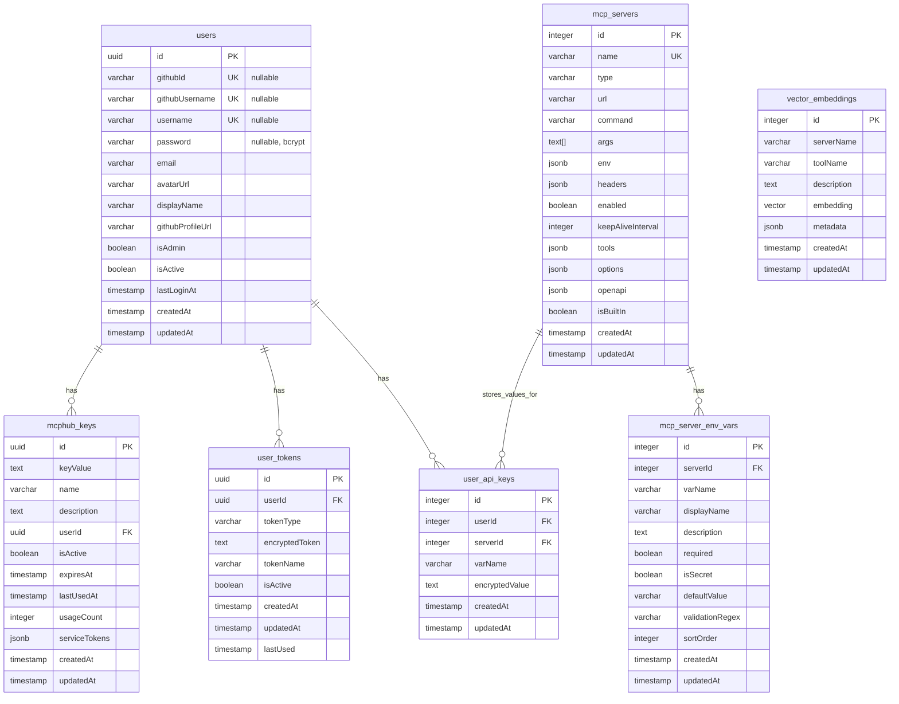

# MCPHub 데이터베이스 스키마

## 개요

MCPHub는 PostgreSQL 데이터베이스를 사용하여 사용자, MCP 서버, API 키, 토큰 등을 관리합니다.

## 테이블 구조

### 1. users (사용자 테이블)

**GitHub OAuth 사용자**와 **로컬 관리자 계정**을 모두 지원하는 통합 사용자 테이블입니다.

```sql
CREATE TABLE users (
  id UUID PRIMARY KEY DEFAULT uuid_generate_v4(),
  -- GitHub OAuth 사용자용 필드 (nullable)
  githubId VARCHAR(50) UNIQUE,
  githubUsername VARCHAR(100) UNIQUE,
  email VARCHAR(255),
  avatarUrl VARCHAR(500),
  displayName VARCHAR(200),
  githubProfileUrl VARCHAR(500),
  -- 로컬 계정용 필드 (nullable)
  username VARCHAR(100) UNIQUE,
  password VARCHAR(255),
  -- 공통 필드
  isAdmin BOOLEAN NOT NULL DEFAULT false,
  isActive BOOLEAN NOT NULL DEFAULT true,
  lastLoginAt TIMESTAMP,
  createdAt TIMESTAMP NOT NULL DEFAULT now(),
  updatedAt TIMESTAMP NOT NULL DEFAULT now()
);
```

**인덱스:**
- `IDX_42148de213279d66bf94b363bf` on `githubId`
- `IDX_fa82b0f0ebcb91e126f0e7bdd2` on `githubUsername`
- `IDX_fe0bb3f6520ee0469504521e71` on `username`

**사용자 유형:**
- **GitHub OAuth 사용자**: `githubId`, `githubUsername` 필드 사용
- **로컬 관리자**: `username`, `password` 필드 사용 (bcrypt 해시)

### 2. mcphub_keys (MCPHub 키 테이블)

사용자별 MCPHub 키와 서비스 토큰을 저장합니다.

```sql
CREATE TABLE mcphub_keys (
  id UUID PRIMARY KEY DEFAULT uuid_generate_v4(),
  keyValue TEXT NOT NULL,
  name VARCHAR(100) NOT NULL,
  description TEXT,
  userId UUID NOT NULL REFERENCES users(id) ON DELETE CASCADE,
  isActive BOOLEAN NOT NULL DEFAULT true,
  expiresAt TIMESTAMP,
  lastUsedAt TIMESTAMP,
  usageCount INTEGER DEFAULT 0,
  serviceTokens JSONB DEFAULT '{}',
  createdAt TIMESTAMP NOT NULL DEFAULT now(),
  updatedAt TIMESTAMP NOT NULL DEFAULT now()
);
```

**인덱스:**
- `IDX_mcphub_keys_user_active` on `(userId, isActive)`

**serviceTokens JSON 구조:**
```json
{
  "GITHUB_TOKEN": "ghp_...",
  "FIRECRAWL_TOKEN": "fc-...",
  "CONFLUENCE_TOKEN": "...",
  "JIRA_TOKEN": "...",
  "JIRA_BASE_URL": "https://...",
  "JIRA_EMAIL": "...",
  "JIRA_API_TOKEN": "..."
}
```

### 3. user_api_keys (사용자 API 키 테이블)

사용자별 MCP 서버 환경변수 값을 암호화하여 저장합니다.

```sql
CREATE TABLE user_api_keys (
  id SERIAL PRIMARY KEY,
  userId INTEGER NOT NULL,
  serverId INTEGER NOT NULL REFERENCES mcp_servers(id) ON DELETE CASCADE,
  varName VARCHAR(100) NOT NULL,
  encryptedValue TEXT NOT NULL,
  createdAt TIMESTAMP NOT NULL DEFAULT now(),
  updatedAt TIMESTAMP NOT NULL DEFAULT now()
);
```

**인덱스:**
- `IDX_54f853f7986ab4a1f0bea1cdc3` UNIQUE on `(userId, serverId, varName)`

### 4. user_tokens (사용자 토큰 테이블)

사용자별 인증 토큰을 저장합니다.

```sql
CREATE TABLE user_tokens (
  id UUID PRIMARY KEY DEFAULT uuid_generate_v4(),
  userId UUID NOT NULL REFERENCES users(id) ON DELETE CASCADE,
  tokenType VARCHAR(50) NOT NULL,
  encryptedToken TEXT NOT NULL,
  tokenName VARCHAR(100),
  isActive BOOLEAN NOT NULL DEFAULT true,
  createdAt TIMESTAMP NOT NULL DEFAULT now(),
  updatedAt TIMESTAMP NOT NULL DEFAULT now(),
  lastUsed TIMESTAMP
);
```

**인덱스:**
- `IDX_ebd5531dd9bea146fb1dfafc13` UNIQUE on `(userId, tokenType)`

### 5. mcp_servers (MCP 서버 테이블)

MCP 서버 정보를 저장합니다.

```sql
CREATE TABLE mcp_servers (
  id SERIAL PRIMARY KEY,
  name VARCHAR(100) NOT NULL UNIQUE,
  type VARCHAR(50) NOT NULL,
  url VARCHAR(500),
  command VARCHAR(200),
  args TEXT[],
  env JSONB DEFAULT '{}',
  headers JSONB DEFAULT '{}',
  enabled BOOLEAN NOT NULL DEFAULT true,
  keepAliveInterval INTEGER,
  tools JSONB DEFAULT '{}',
  options JSONB DEFAULT '{}',
  openapi JSONB,
  isBuiltIn BOOLEAN DEFAULT false,
  createdAt TIMESTAMP NOT NULL DEFAULT now(),
  updatedAt TIMESTAMP NOT NULL DEFAULT now()
);
```

### 6. mcp_server_env_vars (MCP 서버 환경변수 테이블)

MCP 서버별 환경변수 정의를 저장합니다.

```sql
CREATE TABLE mcp_server_env_vars (
  id SERIAL PRIMARY KEY,
  serverId INTEGER NOT NULL REFERENCES mcp_servers(id) ON DELETE CASCADE,
  varName VARCHAR(100) NOT NULL,
  displayName VARCHAR(200),
  description TEXT,
  required BOOLEAN DEFAULT false,
  isSecret BOOLEAN DEFAULT true,
  defaultValue VARCHAR(500),
  validationRegex VARCHAR(200),
  sortOrder INTEGER DEFAULT 0,
  createdAt TIMESTAMP NOT NULL DEFAULT now(),
  updatedAt TIMESTAMP NOT NULL DEFAULT now()
);
```

**인덱스:**
- `IDX_mcp_server_env_vars_server_var` UNIQUE on `(serverId, varName)`

### 7. vector_embeddings (벡터 임베딩 테이블)

도구 검색을 위한 벡터 임베딩을 저장합니다.

```sql
CREATE TABLE vector_embeddings (
  id SERIAL PRIMARY KEY,
  serverName VARCHAR(100) NOT NULL,
  toolName VARCHAR(200) NOT NULL,
  description TEXT,
  embedding vector(1536),
  metadata JSONB DEFAULT '{}',
  createdAt TIMESTAMP NOT NULL DEFAULT now(),
  updatedAt TIMESTAMP NOT NULL DEFAULT now()
);
```

**인덱스:**
- `IDX_vector_embeddings_server_tool` UNIQUE on `(serverName, toolName)`
- `vector_embeddings_embedding_idx` on `embedding` (IVFFlat index)

## 관계도



## 주요 특징

1. **통합 사용자 시스템**: 
   - **GitHub OAuth 사용자**: `githubId`, `githubUsername` 사용
   - **로컬 관리자**: `username`, `password` 사용 (bcrypt 해시)
   - 동일한 테이블에서 두 유형의 사용자 모두 관리

2. **API 키 암호화**: 
   - `user_tokens.encryptedToken`: 인증 토큰 암호화 (AES-256-CBC)
   - `user_api_keys.encryptedValue`: MCP 서버 환경변수 암호화 저장

3. **서비스 토큰 관리**: `mcphub_keys.serviceTokens` JSON 필드에 모든 서비스 토큰이 저장됩니다.

4. **벡터 검색**: `vector_embeddings` 테이블에서 도구 검색을 위한 벡터 유사도 검색을 지원합니다.

5. **환경변수 자동화**: 
   - `mcp_server_env_vars`: 서버별 환경변수 정의
   - `user_api_keys`: 사용자별 실제 값 저장
   - 완전 자동화된 UI 필드 생성

## 마이그레이션 히스토리

### 2025-07-30 (v2.0)
- **User 테이블 확장**: 로컬 관리자 계정 지원 추가
  - `username`, `password` 필드 추가 (nullable)
  - `githubId`, `githubUsername` 필드를 nullable로 변경
  - GitHub OAuth + 로컬 계정 통합 지원
- **사용자 시스템 통합**: mcp_settings.json 사용자 배열 제거, DB 기반으로 완전 통합
- TypeORM 엔티티 정리 및 UserApiKey 엔티티 추가
- 벡터 임베딩 인덱스 최적화

### 2025-07-28 (v1.0)
- `mcp_servers`, `mcp_server_env_vars`, `vector_embeddings` 테이블 추가
- GitHub OAuth 통합 완료
- MCPHub 키 시스템 구현
- 환경변수 자동 감지 시스템 구현 