# MCPHub 데이터베이스 스키마

## 개요

MCPHub는 PostgreSQL 데이터베이스를 사용하여 사용자, MCP 서버, API 키, 토큰 등을 관리합니다.

## 테이블 구조

### 1. users (사용자 테이블)

**GitHub OAuth 사용자**와 **로컬 관리자 계정**을 모두 지원하는 통합 사용자 테이블입니다.

```sql
CREATE TABLE users (
  id UUID PRIMARY KEY DEFAULT uuid_generate_v4(),
  -- GitHub OAuth 사용자용 필드 (nullable)
  githubId VARCHAR(50) UNIQUE,
  githubUsername VARCHAR(100) UNIQUE,
  email VARCHAR(255),
  avatarUrl VARCHAR(500),
  displayName VARCHAR(200),
  githubProfileUrl VARCHAR(500),
  -- 로컬 계정용 필드 (nullable)
  username VARCHAR(100) UNIQUE,
  password VARCHAR(255),
  -- 공통 필드
  isAdmin BOOLEAN NOT NULL DEFAULT false,
  isActive BOOLEAN NOT NULL DEFAULT true,
  lastLoginAt TIMESTAMP,
  createdAt TIMESTAMP NOT NULL DEFAULT now(),
  updatedAt TIMESTAMP NOT NULL DEFAULT now()
);
```

**인덱스:**
- `IDX_42148de213279d66bf94b363bf` on `githubId`
- `IDX_fa82b0f0ebcb91e126f0e7bdd2` on `githubUsername`
- `IDX_fe0bb3f6520ee0469504521e71` on `username`

**사용자 유형:**
- **GitHub OAuth 사용자**: `githubId`, `githubUsername` 필드 사용
- **로컬 관리자**: `username`, `password` 필드 사용 (bcrypt 해시)

### 2. mcphub_keys (MCPHub 키 테이블)

사용자별 MCPHub 키와 서비스 토큰을 저장합니다.

```sql
CREATE TABLE mcphub_keys (
  id UUID PRIMARY KEY DEFAULT uuid_generate_v4(),
  keyValue TEXT NOT NULL,
  name VARCHAR(100) NOT NULL,
  description TEXT,
  userId UUID NOT NULL REFERENCES users(id) ON DELETE CASCADE,
  isActive BOOLEAN NOT NULL DEFAULT true,
  expiresAt TIMESTAMP,
  lastUsedAt TIMESTAMP,
  usageCount INTEGER DEFAULT 0,
  serviceTokens JSONB DEFAULT '{}',
  createdAt TIMESTAMP NOT NULL DEFAULT now(),
  updatedAt TIMESTAMP NOT NULL DEFAULT now()
);
```

**인덱스:**
- `IDX_mcphub_keys_user_active` on `(userId, isActive)`

**serviceTokens JSON 구조:**
```json
{
  "GITHUB_TOKEN": "ghp_...",
  "FIRECRAWL_TOKEN": "fc-...",
  "CONFLUENCE_TOKEN": "...",
  "JIRA_TOKEN": "...",
  "JIRA_BASE_URL": "https://...",
  "JIRA_EMAIL": "...",
  "JIRA_API_TOKEN": "..."
}
```

### 3. user_api_keys (사용자 API 키 테이블)

사용자별 MCP 서버 환경변수 값을 암호화하여 저장합니다.

```sql
CREATE TABLE user_api_keys (
  id SERIAL PRIMARY KEY,
  userId INTEGER NOT NULL,
  serverId INTEGER NOT NULL REFERENCES mcp_servers(id) ON DELETE CASCADE,
  varName VARCHAR(100) NOT NULL,
  encryptedValue TEXT NOT NULL,
  createdAt TIMESTAMP NOT NULL DEFAULT now(),
  updatedAt TIMESTAMP NOT NULL DEFAULT now()
);
```

**인덱스:**
- `IDX_54f853f7986ab4a1f0bea1cdc3` UNIQUE on `(userId, serverId, varName)`

### 4. user_tokens (사용자 토큰 테이블)

사용자별 인증 토큰을 저장합니다.

```sql
CREATE TABLE user_tokens (
  id UUID PRIMARY KEY DEFAULT uuid_generate_v4(),
  userId UUID NOT NULL REFERENCES users(id) ON DELETE CASCADE,
  tokenType VARCHAR(50) NOT NULL,
  encryptedToken TEXT NOT NULL,
  tokenName VARCHAR(100),
  isActive BOOLEAN NOT NULL DEFAULT true,
  createdAt TIMESTAMP NOT NULL DEFAULT now(),
  updatedAt TIMESTAMP NOT NULL DEFAULT now(),
  lastUsed TIMESTAMP
);
```

**인덱스:**
- `IDX_ebd5531dd9bea146fb1dfafc13` UNIQUE on `(userId, tokenType)`

### 5. mcp_servers (MCP 서버 테이블)

MCP 서버 정보를 저장합니다.

```sql
CREATE TABLE mcp_servers (
  id SERIAL PRIMARY KEY,
  name VARCHAR(100) NOT NULL UNIQUE,
  type VARCHAR(50) NOT NULL,
  url VARCHAR(500),
  command VARCHAR(200),
  args TEXT[],
  env JSONB DEFAULT '{}',
  headers JSONB DEFAULT '{}',
  enabled BOOLEAN NOT NULL DEFAULT true,
  keepAliveInterval INTEGER,
  tools JSONB DEFAULT '{}',
  options JSONB DEFAULT '{}',
  openapi JSONB,
  isBuiltIn BOOLEAN DEFAULT false,
  createdAt TIMESTAMP NOT NULL DEFAULT now(),
  updatedAt TIMESTAMP NOT NULL DEFAULT now()
);
```

### 6. mcp_server_env_vars (MCP 서버 환경변수 테이블)

MCP 서버별 환경변수 정의를 저장합니다.

```sql
CREATE TABLE mcp_server_env_vars (
  id SERIAL PRIMARY KEY,
  serverId INTEGER NOT NULL REFERENCES mcp_servers(id) ON DELETE CASCADE,
  varName VARCHAR(100) NOT NULL,
  displayName VARCHAR(200),
  description TEXT,
  required BOOLEAN DEFAULT false,
  isSecret BOOLEAN DEFAULT true,
  defaultValue VARCHAR(500),
  validationRegex VARCHAR(200),
  sortOrder INTEGER DEFAULT 0,
  createdAt TIMESTAMP NOT NULL DEFAULT now(),
  updatedAt TIMESTAMP NOT NULL DEFAULT now()
);
```

**인덱스:**
- `IDX_mcp_server_env_vars_server_var` UNIQUE on `(serverId, varName)`

### 7. user_groups (사용자 그룹 테이블)

사용자별 MCP 서버 그룹을 저장합니다.

```sql
CREATE TABLE user_groups (
  id UUID PRIMARY KEY DEFAULT uuid_generate_v4(),
  name VARCHAR(100) NOT NULL,
  description TEXT,
  servers TEXT[] NOT NULL,
  isActive BOOLEAN NOT NULL DEFAULT true,
  userId UUID NOT NULL REFERENCES users(id) ON DELETE CASCADE,
  createdAt TIMESTAMP NOT NULL DEFAULT now(),
  updatedAt TIMESTAMP NOT NULL DEFAULT now()
);
```

**인덱스:**
- `IDX_user_groups_user_active` on `(userId, isActive)`

### 8. vector_embeddings (벡터 임베딩 테이블)

도구 검색을 위한 벡터 임베딩을 저장합니다.

```sql
CREATE TABLE vector_embeddings (
  id SERIAL PRIMARY KEY,
  serverName VARCHAR(100) NOT NULL,
  toolName VARCHAR(200) NOT NULL,
  description TEXT,
  embedding vector(1536),
  metadata JSONB DEFAULT '{}',
  createdAt TIMESTAMP NOT NULL DEFAULT now(),
  updatedAt TIMESTAMP NOT NULL DEFAULT now()
);
```

**인덱스:**
- `IDX_vector_embeddings_server_tool` UNIQUE on `(serverName, toolName)`
- `vector_embeddings_embedding_idx` on `embedding` (IVFFlat index)

## 관계도

```mermaid
erDiagram
    users ||--o{ mcphub_keys : "has"
    users ||--o{ user_tokens : "has"
    users ||--o{ user_api_keys : "has"
    users ||--o{ user_groups : "has"
    mcp_servers ||--o{ mcp_server_env_vars : "has"
    mcp_servers ||--o{ user_api_keys : "stores_values_for"
    users {
        uuid id PK
        varchar githubId UK "nullable"
        varchar githubUsername UK "nullable"
        varchar username UK "nullable"
        varchar password "nullable, bcrypt"
        varchar email
        varchar avatarUrl
        varchar displayName
        varchar githubProfileUrl
        boolean isAdmin
        boolean isActive
        timestamp lastLoginAt
        timestamp createdAt
        timestamp updatedAt
    }
    mcphub_keys {
        uuid id PK
        text keyValue
        varchar name
        text description
        uuid userId FK
        boolean isActive
        timestamp expiresAt
        timestamp lastUsedAt
        integer usageCount
        jsonb serviceTokens
        timestamp createdAt
        timestamp updatedAt
    }
    user_api_keys {
        integer id PK
        integer userId FK
        integer serverId FK
        varchar varName
        text encryptedValue
        timestamp createdAt
        timestamp updatedAt
    }
    user_tokens {
        uuid id PK
        uuid userId FK
        varchar tokenType
        text encryptedToken
        varchar tokenName
        boolean isActive
        timestamp createdAt
        timestamp updatedAt
        timestamp lastUsed
    }
    mcp_servers {
        integer id PK
        varchar name UK
        varchar type
        varchar url
        varchar command
        text[] args
        jsonb env
        jsonb headers
        boolean enabled
        integer keepAliveInterval
        jsonb tools
        jsonb options
        jsonb openapi
        boolean isBuiltIn
        timestamp createdAt
        timestamp updatedAt
    }
    mcp_server_env_vars {
        integer id PK
        integer serverId FK
        varchar varName
        varchar displayName
        text description
        boolean required
        boolean isSecret
        varchar defaultValue
        varchar validationRegex
        integer sortOrder
        timestamp createdAt
        timestamp updatedAt
    }
    vector_embeddings {
        integer id PK
        varchar serverName
        varchar toolName
        text description
        vector embedding
        jsonb metadata
        timestamp createdAt
        timestamp updatedAt
    }
```



## 주요 특징

1. **통합 사용자 시스템**: 
   - **GitHub OAuth 사용자**: `githubId`, `githubUsername` 사용
   - **로컬 관리자**: `username`, `password` 사용 (bcrypt 해시)
   - 동일한 테이블에서 두 유형의 사용자 모두 관리

2. **API 키 암호화**: 
   - `user_tokens.encryptedToken`: 인증 토큰 암호화 (AES-256-CBC)
   - `user_api_keys.encryptedValue`: MCP 서버 환경변수 암호화 저장

3. **서비스 토큰 관리**: `mcphub_keys.serviceTokens` JSON 필드에 모든 서비스 토큰이 저장됩니다.

4. **벡터 검색**: `vector_embeddings` 테이블에서 도구 검색을 위한 벡터 유사도 검색을 지원합니다.

5. **환경변수 자동화**: 
   - `mcp_server_env_vars`: 서버별 환경변수 정의
   - `user_api_keys`: 사용자별 실제 값 저장
   - 완전 자동화된 UI 필드 생성

## 사용자 관리 시스템 (v2.0)

### 🔧 **사용자 활성화/비활성화**
- `users.isActive` 필드로 사용자 상태 제어
- 비활성화된 사용자는 MCPHub Key 사용 불가
- 관리자는 비활성화 대상에서 제외

### 👤 **관리자 권한 관리**
- `users.isAdmin` 필드로 관리자 권한 제어
- 최소 1명의 관리자 유지 필수 (보호 로직)
- 관리자는 다른 사용자의 권한 변경 가능

### 🗑️ **사용자 삭제**
- **소프트 삭제**: `isActive = false`로 설정
- **하드 삭제**: DB에서 완전 제거 (CASCADE로 관련 데이터 함께 삭제)
- 관리자 삭제 시 추가 보호 로직 적용

### 🔐 **MCPHub Key 제한**
- 비활성화된 사용자의 API 키 자동 차단
- `oauthController.createUserKey`에서 `user.isActive` 검증
- 실시간 사용자 상태 반영

## 마이그레이션 히스토리

### 2025-08-03 (v3.0.0) - 🚨 CRITICAL UPDATE
- **사용자 그룹 스키마 최종 확정**:
  - `user_groups.servers` TEXT[] 배열 형태로 확정 (NOT NULL)
  - `user_groups.name` VARCHAR(100) NOT NULL 제약 조건 추가
  - ❌ `user_group_servers` 테이블 **생성하지 않음** (불필요)
  - ✅ 간단한 배열 구조로 모든 기능 완벽 지원
- **실제 DB 스키마 vs 문서 동기화**: 모든 문서가 실제 구현과 100% 일치
- **TypeORM 엔티티 동기화**: 실제 DB 스키마와 완벽 일치
- **벡터 인덱스 정리**: `vector_embeddings_embedding_idx` IVFFlat 인덱스 재생성
- **마이그레이션 추적**: `schema_migrations` 테이블로 변경사항 기록

### 2025-08-01 (v2.0.1)
- **사용자 그룹 시스템 구현**:
  - `user_groups` 테이블 추가
  - 사용자별 MCP 서버 그룹 관리
  - 그룹 활성화/비활성화 기능
  - 그룹별 서버 필터링
- **API 엔드포인트 추가**:
  - `GET /api/user/groups` - 그룹 목록 조회
  - `POST /api/user/groups` - 그룹 생성
  - `PUT /api/user/groups/:groupId` - 그룹 수정
  - `DELETE /api/user/groups/:groupId` - 그룹 삭제
  - `PATCH /api/user/groups/:groupId/active` - 그룹 활성화/비활성화
- **MCP 서비스 확장**: 그룹 기반 서버 필터링 로직 추가
- **프론트엔드 개선**: 사용자 그룹 관리 UI 구현

### 2025-07-31 (v2.0 완료)
- **사용자 관리 시스템 완전 구현**:
  - 사용자 활성화/비활성화 기능
  - 관리자 권한 토글 기능
  - 사용자 삭제 (소프트/하드 삭제)
  - 관리자 보호 로직 (최소 1명 관리자 유지)
  - MCPHub Key 사용 제한 (비활성화 사용자)
- **API 엔드포인트 추가**:
  - `GET /admin/users/list` - 사용자 목록 조회
  - `PUT /admin/users/:userId/active` - 사용자 활성화/비활성화
  - `PUT /admin/users/:userId/admin` - 관리자 권한 토글
  - `DELETE /admin/users/:userId` - 사용자 삭제
- **UserRepository 확장**: 사용자 관리 메서드 추가
- **타입 안전성 강화**: nullable 필드 처리 개선

### 2025-07-30 (v2.0 시작)
- **User 테이블 확장**: 로컬 관리자 계정 지원 추가
  - `username`, `password` 필드 추가 (nullable)
  - `githubId`, `githubUsername` 필드를 nullable로 변경
  - GitHub OAuth + 로컬 계정 통합 지원
- **사용자 시스템 통합**: mcp_settings.json 사용자 배열 제거, DB 기반으로 완전 통합
- TypeORM 엔티티 정리 및 UserApiKey 엔티티 추가
- 벡터 임베딩 인덱스 최적화

### 2025-07-28 (v1.0)
- `mcp_servers`, `mcp_server_env_vars`, `vector_embeddings` 테이블 추가
- GitHub OAuth 통합 완료
- MCPHub 키 시스템 구현
- 환경변수 자동 감지 시스템 구현 