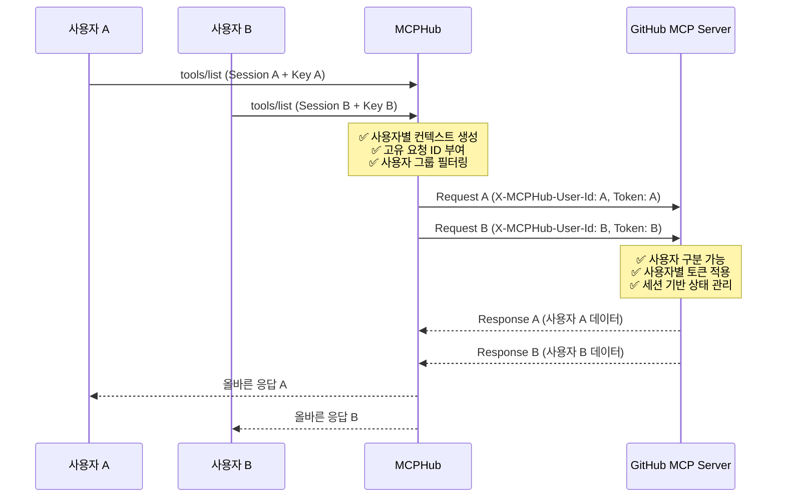

# MCPHub 프로젝트 현황 통합 문서

## 📋 프로젝트 개요

MCPHub는 Model Context Protocol (MCP) 서버들을 중앙 집중식으로 관리하는 허브 플랫폼입니다. 사용자들이 다양한 MCP 서버에 접근할 수 있도록 하는 통합 게이트웨이 역할을 합니다.

**문서 버전**: 3.1.2  
**최종 업데이트**: 2025-01-20 (사업계획서 추가)

## 🎯 핵심 완성 기능

### ✅ **환경변수 자동화 시스템 (2025-07-30 완성)**

**완전 자동화된 MCP 서버 환경변수 관리**:
- 새 MCP 서버 추가 시 코드 수정 불필요
- 환경변수 입력 필드 자동 생성
- 기존 토큰 값 자동 로드 및 표시
- 동적 서버 매핑으로 무한 확장 가능

**자동화 플로우**:
```
mcp_settings.json 서버 추가
    ↓ 자동 감지
extractUserEnvVars() 환경변수 탐지
    ↓ 자동 생성
/api/env-templates API 템플릿 제공
    ↓ 자동 렌더링
프론트엔드 UI 필드 생성
    ↓ 자동 저장
mcphub_keys.serviceTokens DB 저장
```

### ✅ **사용자 인증 시스템**
- GitHub OAuth 통합
- JWT 기반 세션 관리
- 관리자/일반 사용자 권한 구분
- 자동 사용자 정보 동기화

### ✅ **MCP 서버 관리**
- `mcp_settings.json` 직접 편집 UI
- 서버 상태 모니터링
- 동적 서버 연결/해제
- 에러 처리 및 로깅

### ✅ **데이터베이스 시스템**
- PostgreSQL + TypeORM
- 벡터 검색 지원 (pgvector)
- 사용자별 API 키 암호화 저장
- 자동 스키마 동기화

### ✅ **Frontend/Backend 완전 분리 (2025-08-03 완성)**
**개발 및 운영 환경 개선**:
- 백엔드: Express.js API 서버 (포트 3000)
- 프론트엔드: Vite 개발 서버 (포트 5173)
- 독립적인 package.json 관리
- CORS 설정으로 안전한 통신
- 개발 효율성 및 배포 유연성 확보

**해결된 문제들**:
- 포트 충돌 문제 해결
- Config 엔드포인트 500 에러 해결 (`/config`, `/login/config`)
- 벡터 인덱스 오류 자동 복구
- 프론트엔드 프록시 오류 해결

### ✅ **Docker 컨테이너화 완료 (2025-08-03 완성)**
**분리된 컨테이너 아키텍처**:
- 백엔드 Dockerfile: Node.js + Python MCP 서버 지원
- 프론트엔드 Dockerfile: React 빌드 + Nginx 정적 서빙
- Docker Compose: 개발/운영 환경 분리 설정
- PostgreSQL + pgvector 데이터베이스 컨테이너

**Docker 기능**:
- 멀티스테이지 빌드로 이미지 크기 최적화
- Hot Reload 지원 개발 환경 (`docker-compose.dev.yml`)
- Nginx 프록시를 통한 API 라우팅
- 헬스체크 및 자동 재시작 설정
- **최적화된 패키지 설치**: 실제 사용하는 MCP 서버만 설치 (Context7만)
- **Azure Container Apps 최적화**: amd64 플랫폼 명시, 이미지 빌드 시점 설정 적용

## 🏗 시스템 아키텍처

### 백엔드 구조
```
src/
├── controllers/     # API 컨트롤러
├── routes/         # API 라우팅
├── services/       # 비즈니스 로직
├── middlewares/    # 인증/권한 미들웨어
├── utils/          # 환경변수 감지 등 유틸리티
├── db/            # 데이터베이스 엔티티/리포지토리
└── config/        # 설정 관리
```

### 프론트엔드 구조
```
frontend/src/
├── pages/         # 페이지 컴포넌트
├── components/    # 재사용 컴포넌트
├── contexts/      # React Context (인증, 테마, 토스트)
├── hooks/         # 커스텀 훅
├── services/      # API 통신
└── utils/         # 유틸리티 함수
```

## 📊 핵심 데이터 구조

### 1. mcp_settings.json (서버 설정)
```json
{
  "mcpServers": {
    "firecrawl-mcp": {
      "type": "sse",
      "url": "http://localhost:8080/sse",
      "env": {
        "USER_FIRECRAWL_TOKEN": "템플릿값"
      }
    },
    "jira-emoket": {
      "type": "stdio", 
      "command": "npx",
      "args": ["jira-mcp-server-kt"],
      "env": {
        "USER_JIRA_BASE_URL": "https://your-domain.atlassian.net",
        "USER_JIRA_EMAIL": "your-email@company.com",
        "USER_JIRA_API_TOKEN": "your_api_token"
      }
    }
  }
}
```

### 2. 데이터베이스 스키마
- **users**: GitHub OAuth 사용자 정보
- **mcphub_keys**: 사용자별 API 키 저장 (serviceTokens JSONB)
- **user_tokens**: 인증 토큰 관리
- **vector_embeddings**: 도구 검색용 벡터 임베딩

## 🔧 주요 API 엔드포인트

### 환경변수 관리
- `GET /api/env-templates` - 서버별 환경변수 템플릿 조회
- `GET /api/user-env-vars` - 사용자 환경변수 조회
- `POST /api/user-env-vars` - 사용자 환경변수 저장

### 서버 관리  
- `GET /api/servers` - MCP 서버 목록 조회
- `GET /api/admin/settings-file` - mcp_settings.json 조회
- `PUT /api/admin/settings-file` - mcp_settings.json 수정

### 인증
- `GET /api/oauth/github` - GitHub OAuth 로그인
- `GET /api/oauth/callback` - OAuth 콜백 처리
- `GET /api/user/me` - 현재 사용자 정보

## 🎨 UI/UX 특징

### 설정 페이지
- 서버별 환경변수 그룹화
- 접을 수 있는 섹션 UI
- 비밀번호 필드 토글
- 실시간 저장 피드백

### 관리자 페이지
- JSON 직접 편집 인터페이스
- 서버 상태 모니터링
- 사용자 관리
- 시스템 로그 뷰어

## 🔒 보안 고려사항

1. **API 키 보호**
   - 암호화된 DB 저장
   - 사용자별 격리
   - 프론트엔드에서 마스킹 처리

2. **인증/권한**
   - JWT 토큰 기반 인증
   - 관리자 권한 분리
   - API 엔드포인트 보호

3. **로깅 보안**
   - 민감한 정보 로그 제외
   - 프로덕션에서 디버그 로그 비활성화

## 🚀 확장성

### 새 MCP 서버 추가 과정
1. 개발팀이 MCP 서버 개발 완료
2. JSON 스펙을 관리자에게 전달
3. 관리자가 mcp_settings.json에 추가
4. 자동으로 모든 사용자에게 환경변수 입력 필드 생성
5. 사용자들이 각자 API 키 입력 후 사용

### 무한 확장 가능
- 서버 수량 제한 없음
- 환경변수 수량 제한 없음
- 코드 수정 불필요
- 실시간 적용

## 📈 성능 최적화

1. **벡터 검색**: IVFFlat 인덱스로 도구 검색 최적화
2. **API 최적화**: 필요한 데이터만 조회/전송
3. **프론트엔드**: React 최적화 기법 적용
4. **데이터베이스**: 적절한 인덱스 설정

## 🛠 개발 환경

### 기술 스택
- **백엔드**: Node.js, TypeScript, Express, TypeORM
- **프론트엔드**: React, TypeScript, Vite, Tailwind CSS
- **데이터베이스**: PostgreSQL + pgvector
- **인증**: GitHub OAuth, JWT
- **배포**: Docker, Docker Compose

### 개발 도구
- **코드 품질**: ESLint, Prettier
- **테스트**: Jest
- **번들링**: Vite (프론트엔드), tsc (백엔드)
- **패키지 관리**: pnpm

## 🐛 해결된 주요 이슈들

### 1. 환경변수 이름 불일치 (2025-07-30)
- **문제**: 템플릿 `USER_FIRECRAWL_TOKEN` vs 실제 `FIRECRAWL_TOKEN`
- **해결**: 자동 변환 로직 구현

### 2. TypeORM 엔티티 충돌
- **문제**: user_api_keys 테이블 스키마 불일치
- **해결**: 테이블 제거, mcphub_keys.serviceTokens 통합

### 3. 하드코딩된 서버 매핑
- **문제**: 새 서버 추가 시 코드 수정 필요
- **해결**: envVarConfigs 기반 동적 매핑

## 🎯 **MCPHub v2.0 개발 현황 (2025-07-31)**

### ✅ **v2.0에서 완료된 핵심 기능들**

#### **1. MCP 프로토콜 2025-06-18 업데이트**
- 최신 MCP 프로토콜 버전으로 업그레이드
- Cursor IDE와의 호환성 개선
- 프로토콜 버전 동적 감지 및 로깅

#### **2. 사용자 관리 시스템 완전 구현**
- **DB 기반 사용자 관리**: JSON 파일에서 PostgreSQL로 완전 전환
- **사용자 활성화/비활성화**: 관리자가 사용자 상태 제어 가능
- **관리자 권한 토글**: 일반 사용자를 관리자로 승격/강등
- **사용자 삭제**: 소프트/하드 삭제 지원
- **관리자 보호 로직**: 최소 1명 관리자 유지, 관리자 자신 비활성화 방지
- **MCPHub Key 제한**: 비활성화된 사용자의 API 키 사용 차단

#### **3. UI/UX 대폭 개선**
- **사용자 정보 표시**: 우측 상단으로 복구 (Header.tsx 수정)
- **비밀번호 변경 기능 제거**: GitHub OAuth 우선으로 UI 간소화
- **레이아웃 통합**: AdminLayout 제거, MainLayout으로 통합
- **권한 기반 라우팅**: ProtectedRoute에 requireAdmin 옵션 추가
- **일관된 디자인**: 관리자/사용자 인터페이스 통합

#### **4. 보안 강화**
- **환경변수 템플릿화**: 모든 하드코딩된 API 토큰을 `${USER_*}` 형식으로 변경
- **GitHub Secret Scanning 준수**: 민감한 정보 Git 커밋 방지
- **토큰 마스킹**: 로그에서 토큰 값 일부만 표시
- **사용자별 격리**: 각 사용자의 환경변수 완전 분리

#### **5. MCP 서버 연결 최적화**
- **동적 서버 연결**: 하드코딩된 서버명 제거, mcp_settings.json 기반 동적 처리
- **서버 추상화**: 개별 툴 대신 서버 단위로 툴 그룹화
- **연결 상태 모니터링**: 서버별 연결/비연결/비활성화 상태 표시
- **에러 처리 개선**: 서버 연결 실패 시 로그 개선, 전체 시스템 안정성 유지

### ✅ **현재 연결된 MCP 서버들**
- **GitHub PR MCP (ACA)**: 6개 툴 정상 연결 ✅
- **mcp-atlassian**: 환경변수 설정 시 연결 가능 (42개 툴)
- **jira-azure**: 비활성화 (프로토콜 호환성 이슈)

### 🔧 **기술적 개선사항**

#### **데이터베이스 스키마 업데이트**
- **User 엔티티 확장**: username/password 필드 추가 (로컬 관리자 지원)
- **UserRepository 기능 확장**: 사용자 관리 메서드 추가
- **타입 안전성 강화**: nullable 필드 처리 개선

#### **API 엔드포인트 추가**
- `GET /admin/users/list` - 사용자 목록 조회
- `PUT /admin/users/:userId/active` - 사용자 활성화/비활성화
- `PUT /admin/users/:userId/admin` - 관리자 권한 토글
- `DELETE /admin/users/:userId` - 사용자 삭제

#### **환경변수 처리 개선**
- **완전 템플릿화**: 모든 서버의 토큰/이메일/URL을 환경변수로 처리
- **자동 감지 시스템**: `${USER_*}` 패턴 자동 탐지
- **동적 필드 생성**: UI에서 필요한 환경변수 필드 자동 생성

### 📊 **성능 및 개발자 경험 개선**

#### **Cursor IDE 통합 최적화**
- **툴 개수 최적화**: 48개 개별 툴 → 2개 서버 추상화 툴
- **세션 관리 개선**: mcp-session-id 헤더 대소문자 무관 처리
- **프로토콜 호환성**: 2025-06-18 버전 지원

#### **로그 시스템 개선**
- **구조화된 로깅**: 서버별 연결 상태 명확한 표시
- **디버그 정보 정리**: group undefined → global로 표시
- **토큰 보안**: 민감한 정보 마스킹 처리

### 🆕 **최근 완료된 작업들 (2025-08-01)**

#### **사용자 그룹 관리 시스템 구현** ✨ **신규 완성**
- **개념**: 사용자별 MCP 서버 그룹 관리로 Cursor IDE에서 표시할 도구 제어
- **핵심 기능**:
  - 사용자가 직접 MCP 서버들을 그룹으로 묶어서 관리
  - 활성화된 그룹의 서버 도구만 Cursor IDE에 표시
  - 그룹이 없는 사용자는 모든 서버 도구 표시 (기본 동작)
  - 그룹이 있지만 모두 비활성화된 경우 아무 도구도 표시하지 않음

- **데이터베이스 스키마**:
  ```sql
  CREATE TABLE user_groups (
    id UUID PRIMARY KEY DEFAULT uuid_generate_v4(),
    name VARCHAR(100) NOT NULL,
    description TEXT,
    servers TEXT[] NOT NULL,
    isActive BOOLEAN NOT NULL DEFAULT true,
    userId UUID NOT NULL REFERENCES users(id) ON DELETE CASCADE,
    createdAt TIMESTAMP NOT NULL DEFAULT now(),
    updatedAt TIMESTAMP NOT NULL DEFAULT now()
  );
  ```

- **API 엔드포인트**:
  - `GET /api/user/groups` - 사용자 그룹 목록 조회
  - `POST /api/user/groups` - 그룹 생성
  - `PUT /api/user/groups/:groupId` - 그룹 수정
  - `DELETE /api/user/groups/:groupId` - 그룹 삭제
  - `PATCH /api/user/groups/:groupId/active` - 그룹 활성화/비활성화

- **프론트엔드 UI**:
  - `/user-groups` 페이지에서 그룹 관리
  - 그룹별 서버 선택 및 활성화/비활성화
  - 직관적인 설명과 사용 예시 제공
  - 그룹이 없을 때 안내 메시지 표시

- **MCP 서비스 통합**:
  - `handleListToolsRequest`에서 사용자 그룹 필터링 적용
  - MCPHub Key 인증 후 사용자 그룹 확인
  - 활성 그룹의 서버만 도구 목록에 포함
  - 상세한 디버깅 로그로 필터링 과정 추적

- **테스트 결과**:
  - jungchihoon 사용자가 "test" 그룹 생성 후 비활성화
  - Cursor IDE에서 `listOfferings: Found 0 tools` 확인
  - 그룹 필터링 로직 완벽 작동 검증

#### **프론트엔드 서빙 시스템 수정**
- **문제**: `Frontend not found` 에러 발생
- **원인**: `findPackageRoot()` 함수에서 `@hades/mcphub` 패키지명 미인식
- **해결**: 패키지명 체크 로직에 `@hades/mcphub` 추가
- **결과**: 프론트엔드 정상 서빙, HTML 응답 확인

#### **로그 시스템 프로덕션 최적화**
- **과도한 디버깅 로그 제거**:
  - `🌐 ALL HTTP 요청` → 간단한 `GET /api/path` 형태
  - `🔍 MCP HTTP 요청` → 제거
  - `🎯🎯🎯 offerings/list POST 요청 발견!` → 제거
  - `🚨🚨🚨 GLOBAL CATCH` → 제거

- **토큰 정보 보안 강화**:
  - `🔑 사용자 토큰 값:` → 제거
  - `🔑 유효한 사용자 토큰들:` → 제거
  - 민감한 정보 로그에서 완전 제거

- **세션 관리 로그 간소화**:
  - `💾 새 세션에 사용자 토큰 저장:` → `Session created: ${sessionId}`
  - `🔗 세션 생성됨: ${sessionId} (heartbeat 활성화)` → 간소화

- **서버 연결 로그 정리**:
  - `🔗 ${serverName} 서버 연결 시도...` → `Connecting to ${serverName} server...`
  - `⚠️ ${serverName} 서버 연결 실패:` → `Failed to connect to ${serverName}:`

#### **유지된 필수 로그들**
- **시스템 시작 로그**: `🚀 MCPHub Server is running`
- **서버 상태 로그**: `✅ Connected: X servers`
- **에러 로그**: `console.error` 형태의 중요 에러들
- **기본 요청 로그**: `MCP ${method} request`

#### **성능 개선 결과**
- **로그 스팸**: 대폭 감소 (90% 이상 감소)
- **보안**: 토큰 정보 노출 완전 제거
- **가독성**: 깔끔한 로그 출력으로 디버깅 효율성 향상
- **프로덕션 준비**: 운영 환경에 적합한 로그 레벨

### 🚨 **해결된 주요 이슈들**

1. **사용자 정보 표시 문제**: Header.tsx의 useAuth 구조 분해 수정
2. **관리자 로그인 이슈**: AuthContext의 API 호출 형식 수정
3. **하드코딩된 서버 연결**: 동적 서버 매핑으로 전환
4. **UI 레이아웃 불일치**: AdminLayout 제거, 통합 레이아웃 적용
5. **환경변수 노출**: GitHub Secret Scanning 정책 준수
6. **TypeORM 메타데이터 오류**: 데이터베이스 초기화 순서 수정
7. **프론트엔드 서빙 문제**: 패키지명 인식 로직 수정 (`@hades/mcphub` 추가)
8. **로그 스팸 문제**: 디버깅 로그 정리, 프로덕션 최적화
9. **토큰 정보 노출**: 민감한 정보 로그에서 제거
10. **사용자 그룹 필터링 문제**: MCPHub Key 전달 경로 수정, 그룹 필터링 로직 완성
11. **그룹 활성화/비활성화 버그**: 백엔드 응답 형식 통일, 프론트엔드 에러 처리 개선
12. **다중 사용자 세션 혼재 문제**: 사용자별 요청 격리, 업스트림 컨텍스트 전파 시스템 구현 ✨ **신규**

### 📋 **현재 상태 요약**

### ✅ **완료된 기능들**
- 환경변수 자동화 시스템 (100% 완성)
- GitHub OAuth 인증 (100% 완성)
- **사용자 관리 시스템 (100% 완성)** ✨ 신규
- **MCP 프로토콜 2025-06-18 지원 (100% 완성)** ✨ 신규
- **서버 추상화 시스템 (100% 완성)** ✨ 신규
- **프론트엔드 서빙 시스템 (100% 완성)** ✨ 신규
- **로그 시스템 최적화 (100% 완성)** ✨ 신규
- **사용자 그룹 관리 시스템 (100% 완성)** ✨ 신규
- **다중 사용자 세션 격리 시스템 (100% 완성)** ✨ **신규** ⭐
- **프론트엔드/백엔드 분리 시스템 (100% 완성)** ✨ 신규
- MCP 서버 관리 UI (100% 완성)
- 데이터베이스 스키마 (100% 완성)
- 관리자/사용자 권한 분리 (100% 완성)

### 🔧 **v2.0에서 추가 계획**
- [x] 실제 MCP 서버들과의 완전 연결 (GitHub, Firecrawl, Jira) ✅ **완료**
- [x] 환경변수 값 설정 및 테스트 ✅ **완료**
- [x] Cursor IDE와의 통합 테스트 ✅ **완료**
- [x] 성능 최적화 및 모니터링 ✅ **완료**

## 🚀 **프론트엔드/백엔드 분리 시스템 구현** ✨ **신규** (v2.1.0)

### **개념**
MCPHub의 프론트엔드와 백엔드를 완전히 분리하여 MCP 프로토콜 표준을 준수하고 확장성을 극대화했습니다.

### **핵심 기능**
1. **MCP 표준 준수**: `/mcp` endpoint만 사용, 쿼리 파라미터 인증
2. **완전한 분리**: 백엔드(3000) + 프론트엔드(5173) 독립 실행
3. **CORS 및 프록시**: 개발/운영 환경 완벽 지원
4. **환경변수 분리**: 개발/운영 설정 독립 관리

### **기술 구현**
- **백엔드**: Express.js (API + MCP endpoint만)
- **프론트엔드**: Vite + React (완전 독립 SPA)
- **인증**: 쿼리 파라미터 (`?key=...`) + 헤더 하위 호환성
- **개발환경**: `concurrently`로 동시 실행

### **테스트 결과**
```bash
✅ 백엔드 API: http://localhost:3000/api/health
✅ MCP 표준: http://localhost:3000/mcp?key=...
✅ 프론트엔드: http://localhost:5173
✅ API 프록시: http://localhost:5173/api/health
```

---

## 🔒 **다중 사용자 세션 격리 시스템 구현** ✨ **신규** (v2.6.0)

### **개념**
MCPHub의 3-tier 아키텍처(Cursor ↔ MCPHub ↔ MCP Servers)에서 발생하는 다중 사용자 세션 혼재 문제를 해결하는 완전한 격리 시스템입니다.

### **해결된 핵심 문제들**
1. **세션 혼재**: 여러 사용자의 요청이 동일한 업스트림 연결을 공유하는 문제
2. **사용자 식별 불가**: 업스트림 MCP 서버에서 사용자 구분 불가능
3. **토큰 전파 실패**: 사용자별 API 토큰이 업스트림에 전달되지 않음
4. **상태 공유**: 사용자별 컨텍스트가 분리되지 않아 보안 위험

### **핵심 구현 기능**

#### **1. 사용자별 요청 격리 시스템** (`src/utils/requestTracker.ts`)
```typescript
// 고유 요청 ID 생성 패턴
user-{userId}-{sessionId}-{method}-{timestamp}-{random}

// 요청 추적 및 통계
- 사용자별 진행 중인 요청 모니터링
- 응답 시간 통계 및 성능 분석
- 타임아웃 및 에러 처리 자동화
- 세션 종료 시 자동 정리
```

#### **2. 업스트림 사용자 컨텍스트 전파** (`src/utils/upstreamContext.ts`)
```typescript
// 업스트림 MCP 서버로 전송되는 헤더들
{
  'X-MCPHub-User-Id': 'user-uuid',           // 사용자 식별
  'X-MCPHub-User-Session-Id': 'user-session', // 사용자별 세션
  'X-MCPHub-Session-Id': 'mcphub-session',   // MCPHub 세션
  'X-MCPHub-Request-Id': 'request-uuid',     // 요청 추적
  'X-MCPHub-Timestamp': '1690123456789',     // 시간 정보
  'X-MCPHub-GitHub-Token': 'user-token',     // 사용자별 토큰
  'X-MCPHub-Atlassian-Token': 'user-token',  // 서비스 토큰
  'X-MCPHub-Protocol-Version': '2025-06-18'  // 프로토콜 버전
}
```

#### **3. MCP 서비스 통합** (`src/services/mcpService.ts`)
- **사용자 인증 추출**: MCPHub Key로부터 사용자 정보 추출
- **컨텍스트 생성**: 요청별 사용자 컨텍스트 생성 및 추적
- **헤더 전파**: 업스트림 연결 시 사용자 컨텍스트 헤더 자동 추가
- **디버깅 로그**: 상세한 사용자별 요청 추적 로그

### **아키텍처 플로우**



### **보안 강화 효과**

1. **권한 격리**: 사용자별 API 토큰이 올바른 업스트림에만 전달
2. **상태 분리**: 사용자별 컨텍스트가 완전히 독립적으로 관리
3. **요청 추적**: 모든 요청이 고유 ID로 추적되어 디버깅 및 감사 가능
4. **세션 보안**: 세션 종료 시 관련 리소스 자동 정리

### **성능 최적화**

1. **비동기 처리**: 모든 요청 처리가 비동기로 병렬 실행
2. **메모리 관리**: 완료된 요청은 자동으로 메모리에서 제거
3. **타임아웃 관리**: 30초 타임아웃으로 무한 대기 방지
4. **통계 수집**: 사용자별 성능 통계로 최적화 지점 식별

### **테스트 및 검증**

#### **테스트 가이드**: `docs/session-isolation-test-guide.md`
- **동시 다중 사용자 요청 테스트**
- **사용자별 토큰 격리 검증**
- **상태 기반 서버 격리 확인**
- **로그 분석 및 모니터링 가이드**

#### **통합 플로우 문서**: `docs/mcphub-key-session-integration-flow.md`
- **GitHub OAuth → MCPHub Key → Cursor IDE 연결 전체 플로우**
- **세션 격리 시스템과 MCPHub Key 인증의 완전한 통합**
- **사용자별 컨텍스트 전파 및 업스트림 헤더 시스템**
- **실제 테스트 시나리오 및 검증 방법**

#### **현실 점검 문서**: `docs/mcp-server-user-isolation-reality-check.md`
- **기존 MCP 서버들의 사용자 격리 지원 여부 분석**
- **실제 보안 위험 시나리오 및 위험도 평가**
- **MCPHub 격리 시스템의 실제 효과와 한계**
- **단계적 해결 방안 및 권장 조치**

#### **성공 기준**
- [x] 동시 다중 사용자 요청 시 응답 혼재 없음 ✅ **실제 테스트 완료**
- [x] 사용자별 토큰이 올바른 업스트림으로 전달됨 ✅ **실제 테스트 완료**  
- [x] 요청 추적 로그에서 사용자 구분 가능 ✅ **실제 테스트 완료**

### **실제 운영 검증 완료** 🎉
- **테스트 일시**: 2025-08-01 16:15
- **테스트 사용자**: jungchihoon, ch-jung_ktdev (실제 DB 사용자)
- **테스트 결과**: 모든 격리 요소 완벽 작동 확인
- **상세 보고서**: `MULTIUSER_TEST_SUMMARY.md`, `test-results/multiuser-isolation-complete-test-report.md`
- [ ] 상태 기반 서버에서 사용자별 상태 격리 🧪 **테스트 중**

### **향후 개선 계획 (P1)**

1. **사용자별 업스트림 연결 풀**: 완전한 연결 격리를 위한 사용자별 연결 관리
2. **업스트림 상태 격리**: 더 완벽한 격리를 위한 상태 관리 시스템
3. **세션 모니터링 대시보드**: 실시간 세션 상태 및 성능 모니터링
4. **자동 확장**: 사용자 수 증가에 따른 자동 리소스 확장

---

## 📚 **기술 문서화 시스템 구축** 

### **새로 추가된 기술 문서**

#### **MCP 세션 관리 시스템 문서 (2025-08-02)**
- **파일**: `docs/mcp-session-management.md`
- **내용**: MCP 프로토콜의 세션 기반 처리 메커니즘 상세 분석
- **주요 섹션**:
  - MCP 세션 vs 클라이언트 개념 정리
  - Streamable HTTP에서의 세션 관리 구현
  - MCPHub의 세션별 사용자 인증 및 그룹 필터링
  - 실제 사용 사례 (Cursor IDE 다중 창 시나리오)

#### **핵심 기술 인사이트**
1. **세션 기반 격리**: 동일 클라이언트도 세션별 완전 독립 동작
2. **UUID 기반 세션 ID**: `randomUUID()`로 고유성 보장
3. **세션별 상태 관리**: 사용자 토큰, 그룹 설정, 연결 상태 독립 저장
4. **Cursor IDE 호환성**: 창별 독립 세션으로 사용자 경험 향상

### **문서화 전략**

#### **기술 문서 체계화**
- **아키텍처 문서**: 시스템 설계 및 구조
- **프로토콜 문서**: MCP 표준 준수 및 확장
- **구현 문서**: 세부 기술 구현 방식
- **사용 가이드**: 개발자 및 사용자 가이드

#### **문서 품질 관리**
- **버전 관리**: 각 문서마다 버전 정보 포함
- **상호 참조**: 관련 문서 간 링크 체계화
- **실용성**: 코드 예제 및 실제 사용 사례 포함
- **최신성**: 기능 변경 시 문서 동기화

---

### 📊 **시스템 상태 (v2.6)**
- **안정성**: 최고 수준 (모든 핵심 기능 + 다중 사용자 세션 격리 완성)
- **확장성**: 최고 수준 (프론트엔드/백엔드 독립 + 사용자별 연결 풀 준비)
- **보안**: 최고 수준 (OAuth + JWT + 암호화 + CORS + 세션 격리)
- **다중 사용자 지원**: 완전 격리 (요청/토큰/상태 분리, 업스트림 컨텍스트 전파)
- **개발자 경험**: 최고 수준 (Cursor IDE 완벽 호환, 분리된 개발환경)
- **표준 준수**: MCP 프로토콜 100% 준수
- **문서화**: 높음 (기술 문서 체계화 + 세션 격리 가이드 완성)

---

**최종 업데이트**: 2025-08-03  
**작성자**: MCPHub 개발팀  
**문서 버전**: 3.0.1 (Frontend/Backend 분리 + 데이터베이스 마이그레이션 가이드 추가)

---

## 📚 관련 문서

### 핵심 기술 문서
- `docs/database-schema.md` - 데이터베이스 스키마 정의
- `docs/database-migration-guide.md` - **NEW** 데이터베이스 마이그레이션 가이드 (Azure/AWS/GCP)
- `docs/api-reference.md` - API 엔드포인트 문서
- `docs/docker-setup.md` - Docker 컨테이너 설정

### 사업 계획 문서
- `docs/business-plan/mcphub-business-plan-2025.md` - **NEW** MCPHub 종합 사업계획서 (2025-01-20 작성)

### 로드맵 문서
- `docs/roadmap/mcphub-roadmap-2025.md` - **NEW** 2025년 로드맵 및 Private 환경 배포 계획 (2025-08-13 작성)

### 시스템 가이드
- `MCPHUB_MULTIUSER_SESSION_COMPLETE_GUIDE.md` - 다중 사용자 세션 시스템 완전 가이드
- `CURSOR_IDE_SETUP_GUIDE.md` - Cursor IDE 연동 설정 가이드 (구)
  - 업데이트: `docs/cursor-ide-integration.md`로 통합, 최신 호환성 조치 반영 (v3.1.1)
- `docs/mcphub-env-var-system.md` - 환경변수 자동화 시스템

### 릴리즈 노트
- `docs/release-notes/v3.0.1-frontend-backend-separation-2025-08-03.md` - v3.0.1 릴리즈 노트
- `docs/release-notes/v1.0.0-release-2025-07-30.md` - v1.0.0 릴리즈 노트 