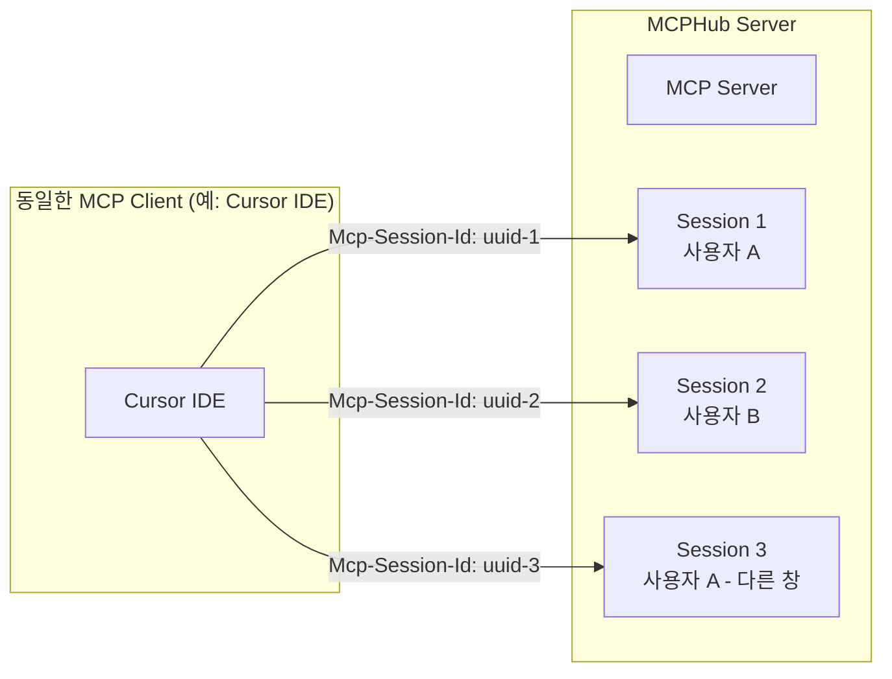
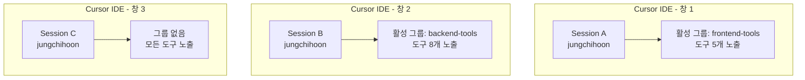

# MCP 세션 관리 시스템

## 📋 개요

Model Context Protocol (MCP)는 **세션 기반 프로토콜**로 설계되어 있으며, MCPHub도 이를 준수하여 구현되었습니다. 본 문서는 MCP의 세션 관리 메커니즘과 MCPHub에서의 구체적인 구현 방식을 설명합니다.

**문서 버전**: 1.0.0  
**작성일**: 2025-08-02  
**대상**: 개발자, 시스템 관리자

---

## 🎯 핵심 개념

### MCP 세션 관리의 기본 원칙

1. **세션 기반 처리**: MCP는 클라이언트 기준이 아닌 **세션 기준**으로 프로토콜을 처리합니다
2. **세션 독립성**: 동일한 클라이언트라도 세션이 다르면 완전히 독립적으로 동작합니다
3. **상태 격리**: 각 세션은 고유한 상태, 권한, 컨텍스트를 유지합니다

### 세션 vs 클라이언트



---

## 🔧 MCP 표준 세션 플로우

### 1. 세션 초기화

```mermaid
sequenceDiagram
    participant Client as MCP Client
    participant Server as MCPHub Server

    Client->>+Server: POST /mcp<br/>InitializeRequest
    Server->>-Client: InitializeResponse<br/>Mcp-Session-Id: 1868a90c-xxxx-xxxx-xxxx-xxxxxxxxxxxx

    Client->>+Server: POST /mcp<br/>InitializedNotification<br/>Mcp-Session-Id: 1868a90c...
    Server->>-Server: 세션별 상태 초기화<br/>사용자 인증, 그룹 설정 등
    Server->>-Client: 202 Accepted
```

### 2. 세션 기반 요청 처리

```typescript
// 클라이언트: 모든 요청에 세션 ID 포함
fetch("/mcp", {
  method: "POST",
  headers: {
    "Content-Type": "application/json",
    "Mcp-Session-Id": sessionId, // 필수!
  },
  body: JSON.stringify(request),
});
```

```typescript
// 서버: 세션 ID로 상태 조회 및 처리
app.post("/mcp", (req, res) => {
  const sessionId = req.headers['mcp-session-id'];
  
  // 세션별 상태 조회
  const sessionInfo = transports.streamable[sessionId];
  const userTokens = sessionInfo?.userServiceTokens;
  const userGroups = sessionInfo?.userGroups;
  
  // 세션별 독립 처리
  processRequest(req.body, userTokens, userGroups);
});
```

---

## 🏗️ MCPHub의 세션 관리 구현

### 1. 세션 생성 및 저장

```typescript
// src/services/sseService.ts
interface TransportInfo {
  transport: StreamableHTTPServerTransport | SSEServerTransport;
  group?: string;
  userServiceTokens?: Record<string, string>; // 세션별 사용자 토큰
  connectionStatus: 'connecting' | 'connected' | 'disconnected' | 'error';
  lastActivityTime: number;
  heartbeatInterval?: NodeJS.Timeout;
  reconnectAttempts: number;
  createdAt: number;
}

// 세션별 독립 저장소
const transports: {
  streamable: Record<string, TransportInfo>, // 세션 ID를 키로 사용
  sse: Record<string, TransportInfo>
} = {
  streamable: {},
  sse: {}
};
```

### 2. 세션 ID 생성

```typescript
// UUID 기반 고유 세션 ID 생성
transport = new StreamableHTTPServerTransport({
  sessionIdGenerator: () => randomUUID(),
  onsessioninitialized: (sessionId: string) => {
    // 세션별 정보 저장
    const transportInfo: TransportInfo = {
      transport,
      group,
      userServiceTokens: userServiceTokens,
      connectionStatus: 'connecting',
      lastActivityTime: Date.now(),
      reconnectAttempts: 0,
      createdAt: Date.now()
    };
    
    transports.streamable[sessionId] = transportInfo;
    console.log(`✅ 세션 생성: ${sessionId}`);
  }
});
```

### 3. 세션별 인증 처리

```typescript
// 세션별 MCPHub Key 인증
export const handleMcpPostRequest = async (req: Request, res: Response) => {
  const sessionId = req.headers['mcp-session-id'] as string;
  const userKey = req.query.key as string;
  
  // 기존 세션 확인
  const isNewSession = !sessionId || !transports.streamable[sessionId];
  
  // 세션별 사용자 토큰 저장
  let userServiceTokens: Record<string, string> = {};
  
  if (userKey) {
    // MCPHub Key 인증 (세션별)
    const authenticatedTokens = await authenticateWithMcpHubKey(userKey, !isNewSession);
    if (authenticatedTokens) {
      userServiceTokens = authenticatedTokens;
      
      // 세션별 토큰 저장
      if (sessionId && transports.streamable[sessionId]) {
        transports.streamable[sessionId].userServiceTokens = userServiceTokens;
      }
    }
  }
};
```

---

## 👥 사용자 그룹과 세션

### 세션별 그룹 필터링

MCPHub의 사용자 그룹 기능도 세션 기반으로 동작합니다:

```typescript
// src/services/mcpService.ts
export const handleListToolsRequest = async (
  request: any, 
  mcpHubKey?: string
): Promise<any> => {
  
  if (mcpHubKey) {
    // 세션별 사용자 인증
    const user = await mcpHubKeyService.getUserByKey(mcpHubKey);
    
    if (user) {
      // 세션별 사용자 그룹 조회
      const userGroups = await userGroupService.findActiveGroupsByUserId(user.id);
      
      if (userGroups.length > 0) {
        // 세션별 서버 필터링
        const activeServerNames = userGroups.flatMap(group => 
          group.servers?.map(server => server.name) || []
        );
        
        filteredServers = serverInfos.filter(serverInfo => 
          activeServerNames.includes(serverInfo.name)
        );
      }
    }
  }
  
  // 세션별 필터링된 도구 반환
  return {
    tools: filteredServers.flatMap(serverInfo => serverInfo.tools || [])
  };
};
```

### 세션 독립성의 실제 영향



---

## 🔄 세션 생명주기

### 1. 세션 생성
- 클라이언트의 첫 `InitializeRequest`
- 서버가 고유 세션 ID 생성 (`randomUUID()`)
- `Mcp-Session-Id` 헤더로 클라이언트에 전달

### 2. 세션 활성화
- 클라이언트가 세션 ID를 모든 요청에 포함
- 서버가 세션별 상태 유지 및 업데이트
- Keep-alive 메커니즘으로 연결 상태 모니터링

### 3. 세션 종료
- 클라이언트 연결 해제
- 세션 타임아웃
- 명시적 세션 종료 요청

```typescript
// 세션 정리
const cleanupTransport = (sessionId: string, type: 'streamable' | 'sse') => {
  const transportInfo = transports[type][sessionId];
  
  if (transportInfo) {
    // Heartbeat 정리
    if (transportInfo.heartbeatInterval) {
      clearInterval(transportInfo.heartbeatInterval);
    }
    
    // 세션 정보 삭제
    delete transports[type][sessionId];
    console.log(`🧹 세션 정리 완료: ${sessionId}`);
  }
};
```

---

## 🚀 실제 사용 사례

### Cursor IDE에서의 다중 세션

1. **시나리오**: 개발자가 Cursor IDE에서 3개 창을 열어 작업
2. **결과**: 각 창마다 독립적인 MCP 세션 생성
3. **효과**: 
   - 창별로 다른 그룹 설정 가능
   - 창별로 다른 도구 세트 사용 가능
   - 한 창의 설정 변경이 다른 창에 영향 없음

### 팀 환경에서의 격리

1. **시나리오**: 여러 개발자가 동일한 MCPHub 인스턴스 사용
2. **결과**: 사용자별, 세션별 완전한 격리
3. **보안**: 
   - 세션별 인증 토큰 격리
   - 사용자별 그룹 설정 독립성
   - 세션 간 데이터 누출 방지

---

## ⚠️ 주의사항

### 개발 시 고려사항

1. **세션 상태 의존성**: 
   - 세션별 상태에 의존하는 로직 설계
   - 세션 종료 시 상태 정리 필수

2. **메모리 관리**:
   - 세션 정보의 메모리 사용량 모니터링
   - 비활성 세션의 적절한 정리

3. **디버깅**:
   - 로그에 세션 ID 포함 필수
   - 세션별 추적 가능한 디버깅 정보

### 운영 환경 권장사항

1. **세션 타임아웃 설정**:
   ```typescript
   const SESSION_TIMEOUT = 30 * 60 * 1000; // 30분
   ```

2. **세션 모니터링**:
   ```typescript
   // 활성 세션 수 모니터링
   const getActiveSessionCount = () => {
     return Object.keys(transports.streamable).length + 
            Object.keys(transports.sse).length;
   };
   ```

3. **세션 정리 정책**:
   - 정기적인 비활성 세션 정리
   - 메모리 사용량 기반 세션 제한

---

## 📚 관련 문서

- [MCP 프로토콜 사양서](https://modelcontextprotocol.io/docs/specification)
- [MCPHub 아키텍처 가이드](./mcphub-project-status.md)
- [사용자 그룹 관리 시스템](./user-personal-groups-feature.md)
- [API 참조 문서](./api-reference.md)

---

## 🔍 추가 정보

### MCP SDK 공식 문서
- [세션 관리 가이드](https://github.com/modelcontextprotocol/specification/docs/basic/transports.md)
- [Streamable HTTP 전송](https://github.com/modelcontextprotocol/specification/docs/basic/transports.md#streamable-http)

### 기술적 참조
- [UUID v4 표준](https://tools.ietf.org/html/rfc4122)
- [Server-Sent Events](https://developer.mozilla.org/en-US/docs/Web/API/Server-sent_events)
- [HTTP Session Management](https://tools.ietf.org/html/rfc6265)

---

**이 문서는 MCPHub v2.1.0 기준으로 작성되었습니다.**