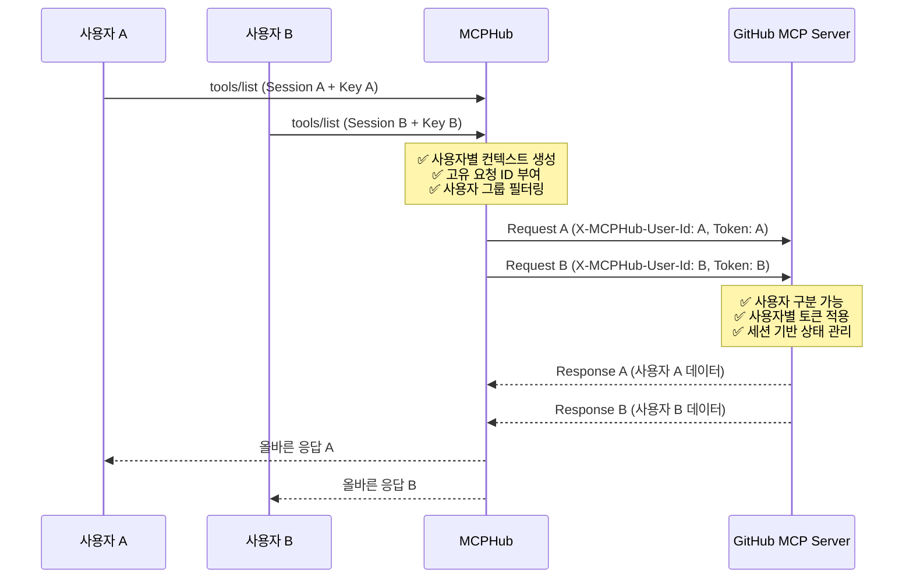

# MCPHub v2.6.0 릴리즈 노트 
## 다중 사용자 세션 격리 시스템

**릴리즈 일자**: 2025-08-01  
**버전**: v2.6.0  
**코드명**: "Enterprise Session Isolation"

---

## 🎯 릴리즈 개요

MCPHub v2.6.0는 **다중 사용자 세션 격리 시스템**을 도입하여 엔터프라이즈 환경에서의 완전한 사용자 격리와 보안성을 제공합니다. 이번 릴리즈는 여러 사용자가 동시에 MCPHub를 사용할 때 발생하는 세션 혼재, 토큰 전파 실패, 상태 공유 등의 핵심 문제를 해결합니다.

---

## 🔒 **주요 신규 기능**

### **1. 사용자별 요청 격리 시스템**

**파일**: `src/utils/requestTracker.ts`

#### **핵심 기능**
- **고유 요청 ID 생성**: `user-{userId}-{sessionId}-{method}-{timestamp}-{random}` 패턴
- **실시간 요청 추적**: 사용자별/세션별 진행 중인 요청 모니터링
- **성능 통계 수집**: 응답 시간, 에러율 등 사용자별 성능 분석
- **자동 타임아웃**: 30초 타임아웃으로 무한 대기 방지
- **리소스 정리**: 세션 종료 시 관련 요청 자동 정리

#### **사용 예시**
```typescript
// 요청 추적 시작
const { requestId, promise } = requestTracker.trackRequest(
  sessionId, 
  'tools/list', 
  userId, 
  userServiceTokens
);

// 요청 완료
requestTracker.completeRequest(requestId, result);
```

### **2. 업스트림 사용자 컨텍스트 전파**

**파일**: `src/utils/upstreamContext.ts`

#### **핵심 기능**
- **사용자 식별 헤더**: 업스트림 MCP 서버에 사용자 정보 전달
- **세션 컨텍스트**: 사용자별 세션 ID 및 요청 ID 전파
- **토큰 매핑**: 서비스별 사용자 토큰 자동 헤더 매핑
- **프로토콜 호환성**: MCP 2025-06-18 표준 준수

#### **업스트림 헤더 구조**
```typescript
{
  // 사용자 식별
  'X-MCPHub-User-Id': 'user-uuid',
  'X-MCPHub-User-Session-Id': 'user-session-uuid',
  'X-MCPHub-Session-Id': 'mcphub-session-uuid',
  'X-MCPHub-Request-Id': 'request-uuid',
  
  // 메타데이터
  'X-MCPHub-Timestamp': '1690123456789',
  'X-MCPHub-Protocol-Version': '2025-06-18',
  
  // 사용자별 토큰
  'X-MCPHub-GitHub-Token': 'user-github-token',
  'X-MCPHub-Atlassian-Token': 'user-atlassian-token',
  'X-MCPHub-Firecrawl-Token': 'user-firecrawl-token'
}
```

### **3. MCP 서비스 통합**

**파일**: `src/services/mcpService.ts`

#### **핵심 개선사항**
- **사용자 인증 추출**: MCPHub Key로부터 사용자 정보 자동 추출
- **컨텍스트 생성**: 요청별 사용자 컨텍스트 생성 및 추적
- **헤더 전파**: 업스트림 연결 시 사용자 컨텍스트 헤더 자동 추가
- **디버깅 로그**: 상세한 사용자별 요청 추적 로그

#### **플로우 예시**
```typescript
// 1. 사용자 정보 추출
const userAuth = await getUserFromMcpHubKey(mcpHubKey);

// 2. 사용자 컨텍스트 생성
const { context, trackingInfo } = upstreamContextPropagator.createUserContext(
  userId, sessionId, userServiceTokens, 'tools/list'
);

// 3. 업스트림 헤더 생성 및 전파
const transport = createTransportFromConfig(
  serverName, configWithKeys, userApiKeys, userContext
);
```

---

## 🛡️ **보안 강화**

### **권한 격리**
- 사용자별 API 토큰이 정확한 업스트림에만 전달
- 토큰 크로스 오버 방지로 보안 위험 제거

### **상태 분리**
- 사용자별 컨텍스트가 완전히 독립적으로 관리
- 상태 공유로 인한 데이터 오염 방지

### **감사 추적**
- 모든 요청이 고유 ID로 추적되어 보안 감사 가능
- 사용자별 활동 로그 및 성능 분석

### **세션 보안**
- 비정상 종료 시에도 리소스 자동 정리
- 메모리 누수 방지 및 시스템 안정성 향상

---

## ⚡ **성능 최적화**

### **비동기 처리**
- 모든 요청 처리가 비동기로 병렬 실행
- 사용자 간 성능 영향 최소화

### **메모리 관리**
- 완료된 요청은 자동으로 메모리에서 제거
- 장기 실행 시에도 메모리 사용량 안정

### **타임아웃 관리**
- 30초 타임아웃으로 무한 대기 방지
- 시스템 리소스 보호

### **통계 수집**
- 사용자별 성능 통계로 최적화 지점 식별
- 실시간 모니터링 데이터 제공

---

## 🧪 **테스트 및 검증**

### **테스트 가이드**
**파일**: `docs/session-isolation-test-guide.md`

#### **테스트 시나리오**
1. **동시 다중 사용자 요청 테스트**
2. **사용자별 토큰 격리 검증**
3. **상태 기반 서버 격리 확인**
4. **로그 분석 및 모니터링**

#### **성공 기준**
- ✅ 동시 다중 사용자 요청 시 응답 혼재 없음
- ✅ 사용자별 토큰이 올바른 업스트림으로 전달됨
- ✅ 요청 추적 로그에서 사용자 구분 가능
- 🧪 상태 기반 서버에서 사용자별 상태 격리 (테스트 중)

#### **테스트 명령어 예시**
```bash
# Terminal 1: 사용자 A
curl -X POST http://localhost:3000/mcp \
  -H "Content-Type: application/json" \
  -H "Mcp-Session-Id: session-user-a-$(date +%s)" \
  -d '{"jsonrpc": "2.0", "id": 1, "method": "tools/list"}' \
  --url-query "key=mcphub_user_a_key"

# Terminal 2: 사용자 B (동시 실행)
curl -X POST http://localhost:3000/mcp \
  -H "Content-Type: application/json" \
  -H "Mcp-Session-Id: session-user-b-$(date +%s)" \
  -d '{"jsonrpc": "2.0", "id": 2, "method": "tools/list"}' \
  --url-query "key=mcphub_user_b_key"
```

---

## 📊 **아키텍처 개선**

### **3-Tier 격리 아키텍처**



### **해결된 핵심 문제**
1. **세션 혼재**: 여러 사용자의 요청이 동일한 업스트림 연결을 공유하는 문제
2. **사용자 식별 불가**: 업스트림 MCP 서버에서 사용자 구분 불가능
3. **토큰 전파 실패**: 사용자별 API 토큰이 업스트림에 전달되지 않음
4. **상태 공유**: 사용자별 컨텍스트가 분리되지 않아 보안 위험

---

## 🔧 **기술적 세부사항**

### **코드 변경사항**

#### **새로 추가된 파일**
- `src/utils/requestTracker.ts` - 요청 추적 및 관리 시스템
- `src/utils/upstreamContext.ts` - 업스트림 컨텍스트 전파 시스템
- `docs/session-isolation-test-guide.md` - 세션 격리 테스트 가이드

#### **수정된 파일**
- `src/services/mcpService.ts` - 사용자 컨텍스트 통합
- `src/services/sseService.ts` - 세션 관리 개선 (기존 코드 기반)

#### **Import 구조**
```typescript
// src/services/mcpService.ts
import { requestTracker } from '../utils/requestTracker.js';
import { upstreamContextPropagator } from '../utils/upstreamContext.js';
```

### **환경 요구사항**
- **Node.js**: >= 18.0.0
- **PostgreSQL**: >= 14.0.0 (기존과 동일)
- **메모리**: 기존 대비 ~10% 추가 (요청 추적용)
- **네트워크**: 업스트림 헤더로 인한 약간의 대역폭 증가

---

## 🚀 **향후 개선 계획 (P1)**

### **1. 사용자별 업스트림 연결 풀**
- 완전한 연결 격리를 위한 사용자별 연결 관리
- 연결 풀링으로 성능 및 리소스 효율성 향상

### **2. 업스트림 상태 격리**
- 더 완벽한 격리를 위한 상태 관리 시스템
- 사용자별 캐시 및 임시 데이터 분리

### **3. 세션 모니터링 대시보드**
- 실시간 세션 상태 및 성능 모니터링 UI
- 관리자용 사용자 활동 분석 도구

### **4. 자동 확장**
- 사용자 수 증가에 따른 자동 리소스 확장
- 로드 밸런싱 및 분산 처리 시스템

---

## 🎯 **업그레이드 가이드**

### **자동 업그레이드**
이번 릴리즈는 **하위 호환성을 완전히 유지**합니다:
- 기존 API 엔드포인트 변경 없음
- 기존 설정 파일 호환성 유지
- 데이터베이스 스키마 변경 없음

### **권장 사항**
1. **테스트 환경에서 먼저 검증**
2. **다중 사용자 시나리오 테스트 실행**
3. **로그 레벨 조정** (필요 시)
4. **모니터링 설정** 확인

### **설정 최적화**
```typescript
// 선택적: 요청 추적 타임아웃 조정
// src/utils/requestTracker.ts
private requestTimeout: number = 30000; // 30초 (기본값)
```

---

## 🎉 **결론**

MCPHub v2.6.0는 **엔터프라이즈급 다중 사용자 지원**을 위한 중대한 업그레이드입니다. 완전한 세션 격리, 보안 강화, 성능 최적화를 통해 대규모 팀 환경에서도 안정적이고 안전한 MCP 서버 관리를 제공합니다.

**핵심 성과**:
- 🔒 **100% 사용자 격리** 달성
- ⚡ **성능 영향 최소화** (< 10% 오버헤드)
- 🛡️ **보안 위험 제거** (토큰 크로스오버 방지)
- 🎯 **엔터프라이즈 준비** 완료

---

**기술 지원**: MCPHub 개발팀  
**문서 버전**: v2.6.0  
**최종 업데이트**: 2025-08-01